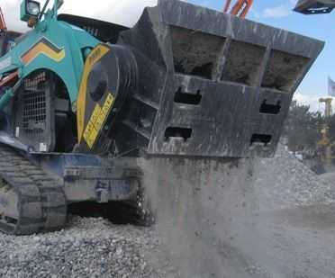

MB لا يتوقف أبدا. استثمارات كبيرة في البحث والتطوير وإيلاء اهتمام خاص للاحتياجات المحددة لكل موقع، وارتفاع لاثنين من الموديلات الجديدة التي تؤدي إلى ما يصل إلى 4 مصانع مصممة لوادر انزلاقية التوجيه ولوادر لودر:"MB-L120لشفرات MINI من 2.8 طنغرافة و5-7 TON ""MB-L140لشفرات MINI من 3 TONغرافة و6-8 TON "وشهادة فريدةجنبا إلى جنب مع MB مجموعة كاملة، وأصحاب براءات الاختراع فقط لحركة مزدوجة في الفك،لضمان أقصى قدر من الإنتاجية في جميع أنواع مواقع العملخفيفة الوزن وصغيرة الحجملسهولة التركيب والاستخدام وضمان الأداء العالي