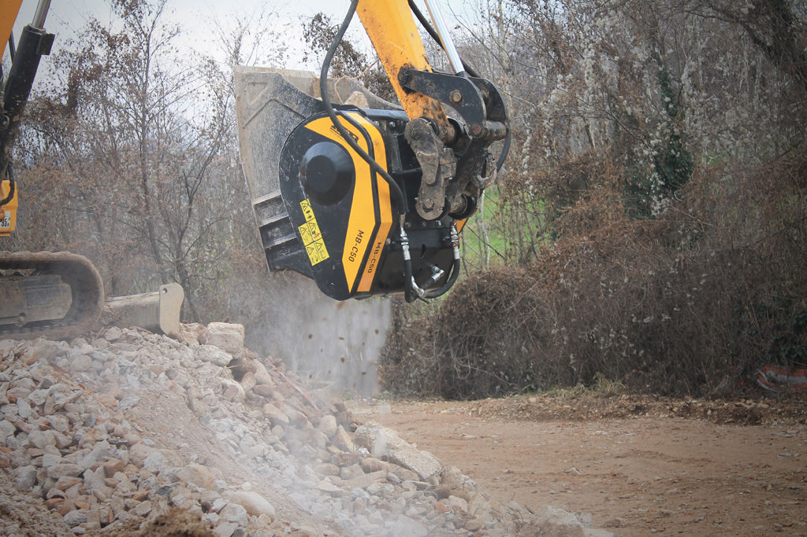

ر لا يتوقف تصاعد النجاحات MB !

رائدة على مستوى العالم في مجال سحق ، وهدم و إعادة التدوير ، وقد فازت MB بالجائزة الدولية أخرى : فهو محطم MB - C50 دلو ، جوهرة مجموعة ، التي فازت في لجنة التحكيم الدولية لل "الأرض والجوائز المقاول المدني" الجائزة الاسترالية التميز في صناعة البناء والتشييد ، الذي يمثل مجموعة صغيرة من " جوائز ابتكار المنتجات " .

ضربت لجنة التحكيم من حقيقة أن المنتجات الصغيرة مثل MB- C50 يمكن أن تكون مرنة جدا و مثمرة على كافة مواقع البناء ، وخاصة الصغيرة منها . ليس ذلك فحسب، هيئة المحلفين أقرت القيمة المضافة من الكسارة MB التي تتيح إعادة استخدام المواد سحقت محليا ، والمساهمة في الحفاظ على البيئة في أوسع حقبة جديدة من البناء المستدام و " الاقتصاد الأخضر " . الصغيرة، و مفيدة و صغيرة للغاية ، و MB- C50 هو أصغر منتجات مجموعة  MB. تم تصميم وزنها أقل من طن و احد للعمل مع حفارات من 4 أطنان ، عن وظائف صغيرة داخل سحق أعمال الطرق ، والسباكة و البناء. بفضل خصائصه من حيث انخفاض وزن وحجم المعدات يثبت مفيدة بشكل خاص في هدم مبنى صغير و في قطاع الحدائق العامة، و حتى في مناطق العمل محدودة جدا ، وضمان الأداء العالي ، و إنتاج ما يصل إلى 10 m3/he النتائج أعلى مستوى ، وهي سمة مشتركة ل مجموعة كاملة من كساراة MB

