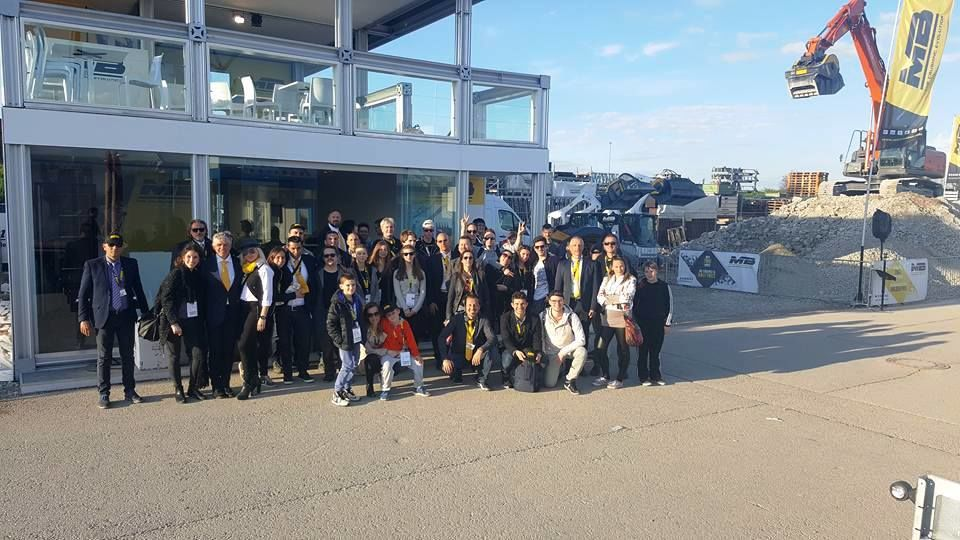

世界最大級の建設機械の見本市、バウマ2016が4月11日〜17日にドイツのミュンヘンにて開催されました。MB は例年同様大盛況を収めることができました。

イタリア北部のヴィチェンツァに本社を置くMBにとって、バウマ国際見本市は世界中のお客様に製品を知って、見て、体感して頂く重要な展示会です。

現地法人のMBドイツだけでなく、世界中のMBチームが結集し様々な国から来たお客様に大人気のクラッシャーや最新のスクリーンバケットをご紹介しました。

数千人のお客様がMBの3つのブースに足を運んで下さいました。1つはインフォメーションブース、また別のブースではMBの全てクラッシャーとスクリーンバケットを展示し、屋外には600平方メートルにも及ぶデモンストレーションエリアを設けました。デモンストレーションエリアでは4機のクラッシャーとスクリーンバケットの実演を通して環境に優しく、時間と経費を削減できるMB製品の特徴を体感して頂きました。

## MB-LS220
大好評を頂いているMBクラッシャーの他に、今回の展示会では新登場のMB-LS200(12-35トンのバックホーローダー取付可)も展示しました。バックホーローダー対応のスクリーンバケットとしては建機市場で初となる大型サイズの同機は内網の網目サイズをお客様の用途により交換頂けます。高い処理能力を発揮するために設計されたMB-LS200はあらゆる素材を仕分けすることができます。

MBと長年のお付き合いを頂いているディーラーの皆様、個人のお客様、またMBを今展示会で知ってくださったお客様から多くのお問い合わせを頂きました。たくさんのご来場本当にありがとうございました。

MBは 今後も皆様から愛される製品を世界中の現場のお客様へご提供できるようお客様の声を製品に反映させていきます！