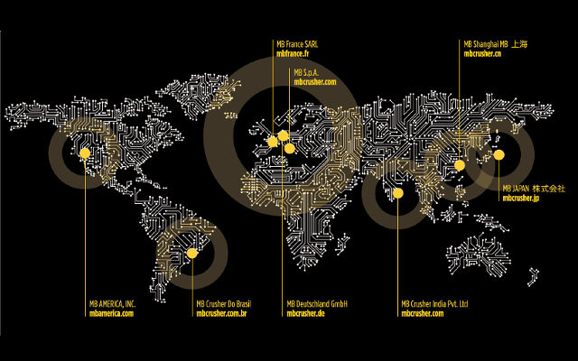

# より多くのお客様に最新の革新技術とサポートをいち早くお届けするため、MB代表取締役社長のグイド・アゾリンは新たちMBブラジルを立ち上げました
MBがイタリア本社にて二枚刃のバケットクラッシャーを開発してから15年が経ち、MBブラジルは設立されます。バケットクラッシャーとスクリーンバケットのデザインや生産・販売技術において世界のリーディングカンパニーであるMBへの需要は大変多く、サンパウロの新支店より新たなネットワークを構築することにしたのです。MBブラジル支店開設により以下のことが実現されます。

- 破砕・リサイクル現場において新たなソリューションのご提供
- ブラジルへの製品輸送のシステム化
- ご購入前とご購入後のサポート強化
- 質の高いディーラーネットワークの構築
- 技術面のアフターサポート
- カスタマーサービスの充実
- ブラジル通貨、レアルでの現地支払い

MBの代表取締役社長グイドアゾリンは「現地法人を立ち上げることで安定的な販売と独自のマーケットへアプローチができ、また地域の活性化へ貢献できる」と語っています。 

今回のブラジル支店の開設でMBは世界に8支店のネットワークを持つことになります。さらに世界中の物流センター、ディーラーネットワーク、認定修理工場と協力し世界中のお客様をサポートしています。

17,000㎡にも及ぶ敷地を有すイタリア・ファラにあるMB本社は、100%メイドインイタリー品質を今日も世界中にお届けします。

