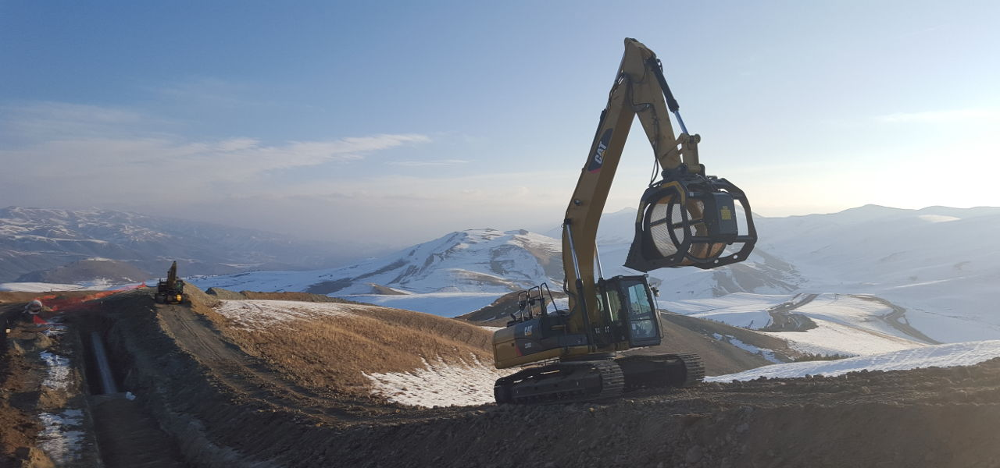
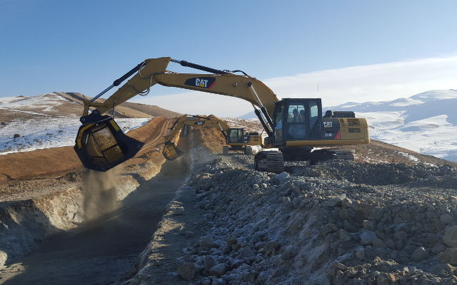
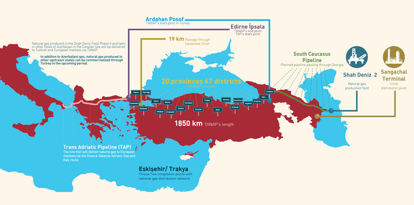

# MBは今回の一大プロジェクトのパートナーとして選ばれ、現在13機のMBスクリーンバケットMB-S18 S3がアゼルバイジャン、グルジア、トルコが使われています

カスピ海のアゼルバイジャン・南コーカサスでグルジアとトルコを結ぶ692kmにも及ぶガス輸送パイプライン工事が始まりました。

今回の南コーカサスパイプライン工事は既存のBTCパイプラインの地下に作られ、トルコ、アゼルバイジャン、グルジアへ天然ガスを届けます。工事が終わる頃には最大で250億㎥ものガスをトルコのエルズルムを通って供給します。

南コーカサスパイプラインは1900kmも離れたトルコ西部の国境でアドリア海パイプラインと接続します。また、トルコ東部の国境ではアナトリアパイプラインに連結します。 アドリア海パイプラインは、ギリシャと南イタリア・アドリア海の下で接続し、そこからアルバニアへ連結しています。 アドリア海パイプラインの長さはあわせて約870kmにも及びます。

MBは今回の一大プロジェクトのパートナーとして選ばれ、現在13機のMBスクリーンバケットMB-S18 S3がアゼルバイジャン、グルジア、トルコが使われています。
<iframe width="548" height="308" src="https://www.youtube.com/embed/gWb97neYoTU" frameborder="0" allow="accelerometer; autoplay; clipboard-write; encrypted-media; gyroscope; picture-in-picture" allowfullscreen></iframe>

MB-S18 S3スクリーンバケットは20〜35トンクラスの油圧ショベルに取付可能で、採掘された骨材をその場で再利用する事を実現します。特に道路工事、土木工事、パイプラインのメンテナンスに最適です。骨材を現場の外に持ち出すことなく、リサイクルができるのです。また、MB-S18 S3すクリーンバケットにはマグネットとスプレーキット(噴霧器)をオプションで搭載することもでき、鉄の分別や粉塵の発生を抑えることができます。

MBスクリーンバケットは、骨材の破砕活動の前後に分別し、破砕活動の効率を飛躍的にあげます。
網は用途によって編目サイズの交換ができ、パネル式なのでサイズ交換も簡単です。
独自開発されたスクリーンの形状は高い処理能力と分別能力を第一に考えデザインされました。