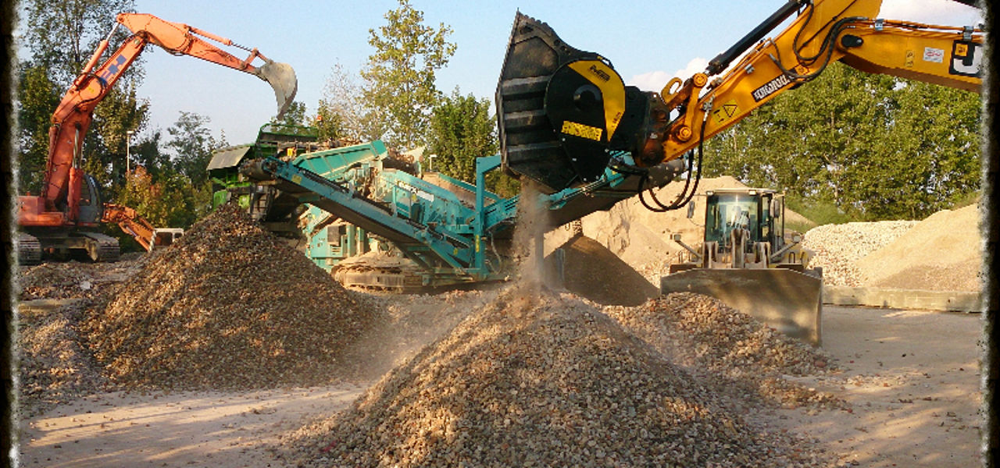

<iframe width="750" height="422" src="https://www.youtube.com/embed/87DfYg0IqD0" frameborder="0" allow="accelerometer; autoplay; clipboard-write; encrypted-media; gyroscope; picture-in-picture" allowfullscreen></iframe>
固定式破砕機をお持ちのお客様はバケットクラッシャーを不要とお考えかもしれません。。
お待ち下さい！
 

固定式破砕機やモービルクラッシャーとアタッチメント式クラッシャーの同時使用はなかなか想像できません。
 
しかし同時に利用することで作業効率が飛躍的にあがります。
