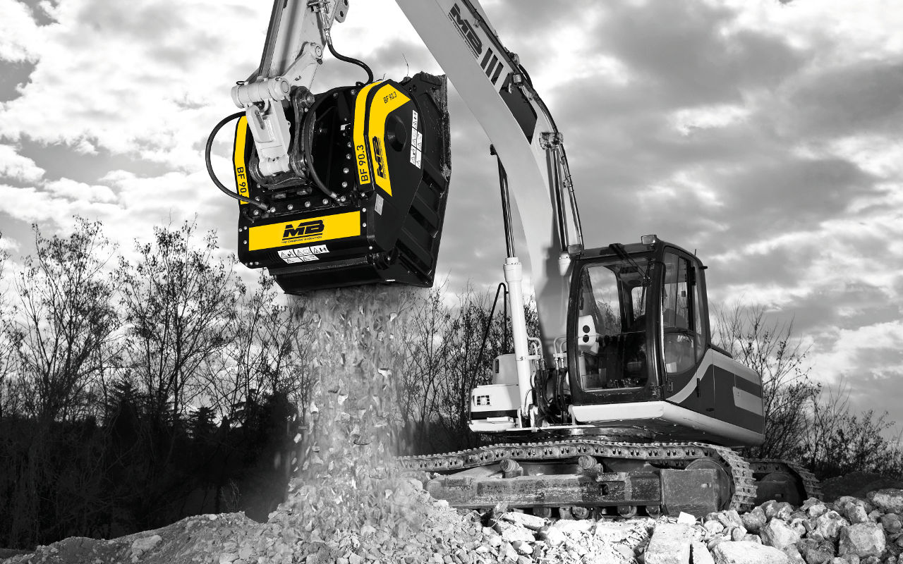

# MBは BF90.3 S4を新たに建設・リサイクル業界に発表 最高品質がさらにパワーアップ
常に新しいアイディアと高品質で市場を魅了し、プロフェッショナルに徹し、15年以上に渡り製品を改良し続けているMBは破砕分野とリサイクル分野を牽引してきました。

## BF90.3 S4

バケットクラッシャーBF90.3は世界で初めて製造されたバケットクラッシャーであり、また唯一特許を取得しているバケットでもあります。コンパクトで頑丈なBF90.3 はどんなに過酷な条件の現場でもその能力を発揮します。

今回、そのBF90.3がさらに改良されどんな物質を砕いても同じように高いパフォーマンスができるようになりました。

旧型との比較改良点は以下の通りです。

- 内部構造の見直しにより、安定性と精密性が上がり処理能力が向上しました。
- 破砕後の排出口寸法の幅が広がりました。
- グリスアップの位置を変更しメンテナンスがより容易になりました。
- 各パーツの補強により、さらに耐性が増しました。

MBの製造部門長であるディエゴ・アゾリンは「革新は計算で起こせるものではなく、常に改良を続けていく結果起こります。」と語っています。ディエゴの元でMBチームは日々製品の改良を続けています。

MBのリサーチ部門では常に顧客満足度の向上の為、お客さまの声からMB製品のさらなるポテンシャルを発掘しています。お客様の意見を製品開発に反映し、MBは業界で最大のサイズ幅をもっています。このMBの製品開発力がお客様を魅了し続ける理由です。

2001年にイタリアで創設されたMBは現在、世界 8ヶ所に支店があり、世界中の販売代理店と修理工場と提携をしています。 全ての製品開発・製造は新設されたMB本社（イタリア・ヴィチェンツァ州）で行われており、100%メイドインイタリーです。