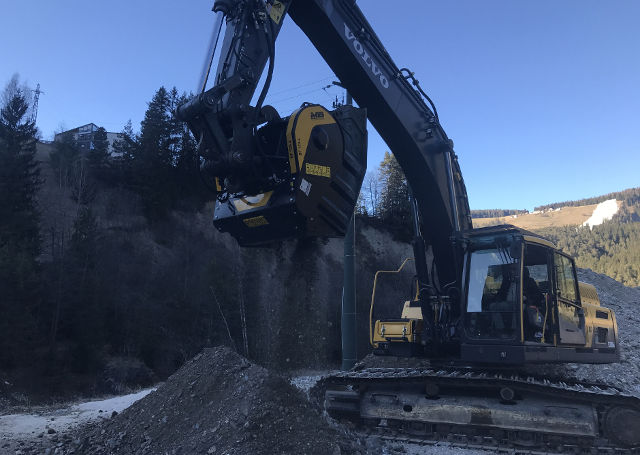
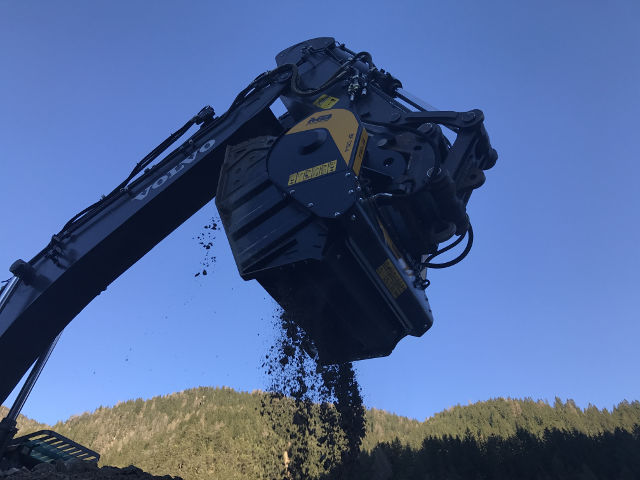

# MBバケットクラッシャーBF120.4の第4世代を発表
その現場を知っている者にしかわからない過酷さがあります。現場はイタリア・アルプス山脈に位置します。ローリーで地上から何キロも走りやっと現場に到着し、注意深く全ての作業を行わなくてはなりません。少しのミスでも、何日もの行程を遅らせるからです。

スキー場での工事・基礎工事等の作業は困難を極めます。作業時間も限られ、ミスやロスは最小限に抑えなくてはなりません。

こういった状況下では、通常の方法では難しいため特殊な方法が用いられます。そこで活躍したのがMBバケットクラッシャーです。イタリアのスキーリゾート「アルタベルタ」のメンテナンス工事を請け負う建設会社はMBバケットクラッシャーを購入しました。

MBバケットクラッシャーBF120.4の最新モデルは新たに様々な現場で活躍しています。通常のモービルクラッシャーと違い、MBバケットクラッシャーは専属のオペレーターが不要で、搬入も簡単です。この点がMBが選ばれる理由の一つでもあります。山頂まで大型のクラッシャーを運搬するのは難しく、コストも莫大にかかります。また、破砕後の骨材を山頂から降ろす運搬作業も難しく費用がかかり、埋め立て用の路盤材を地上から運ぶことも難しくなります。

もう一つのBF120.4 第4世代の強みは(他のバケットクラッシャーシリーズ同様)メンテナンスコストの削減と容易さにあり、小さな物質も破砕できるようになりました。

## 第4世代 〜さらなる進化

BF120.4 第4世代は重さ4.8トンで30トン以上の重機に取付け可能です。積載容量は1.3㎥で最大53㎥／時もの破砕能力があります。 また、BF120.4 S4は本体の重心バランスも改良され、メンテナンス費用も削減することに成功しました。

破砕排出口の調整幅も広がりました。15mm〜145mmまで破砕口のサイズを調整する事が可能です。各内蔵パーツが補強されバケット本体の耐久性が上がり、さらなる衝撃にも耐えられるようになりました。修理頻度も減り収益性があがる結果となりました。オイルフローは210ℓ/分で、より機敏な破砕運動で破砕スピードも上がりました。

<iframe width="548" height="308" src="https://www.youtube.com/embed/-xUHy68W3zY" frameborder="0" allow="accelerometer; autoplay; clipboard-write; encrypted-media; gyroscope; picture-in-picture" allowfullscreen></iframe>