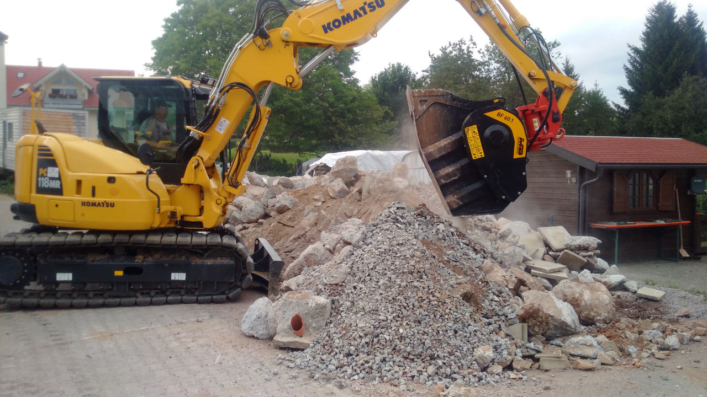
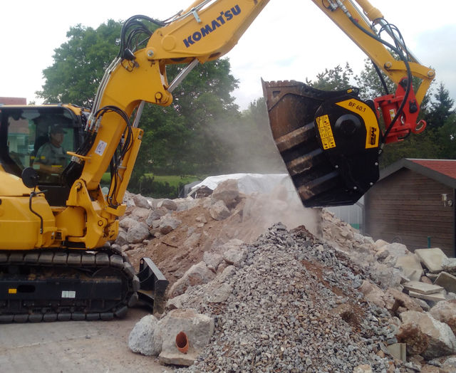

「自社で一貫して全ての作業を行うこと」は世界中の建設会社にとって理想的です。オペレーターと車両を自前で用意できれば、めまぐるしく発展を続けるリサイクル・建設業界において競合他社と差がつけられます。特別な技術や特殊機械をレンタルしたり外注したりせず、コストが削減でき利益を生む事ができるからです。

MB の顧客であるドイツの建設業社 Schäuble Hoch- und Tiefbau GmbH のオーナーは「MB バケットクラッシャー BF60.1 を 2016 年 9 月に購入しました。BF60.1 を使い始めてからビジネスの可能性が広がりました。」と語っています。

「MB バケットクラッシャーでコスト削減ができることは知っていました。しかしそれだけではなく、現場で発生した骨材をその場で再利用でき、またその骨材を他の建設会社に販売することができたのです。我々は主に解体作業を請け負っているので現場からたくさんの骨材が発生します。それを道路工事等の他の現場で再利用することもしています。BF60.1 をコマツ PC118 に取り付けて作業していますが、こんなに小さなバケットが玄武岩を破砕することもできたのには驚きました。BF60.1 は小さなアタッチメントですがとても信頼でき大変満足しています。またアフターサービスも充実しています。」

## 更なる革新へ　〜　 BF60.1 第 4 世代の登場

８トン以上の重機に取付け可能で MB バケットクラッシャー BF60.1 は S4 バージョン(第 4 世代)が発売されます。この最新モデルはバケットの内部構造と技術が改良されています。 まず、バケットのレイアウトが大幅に改良されました。より機敏な動きを可能にし破砕運動の速度を上げることができ、重機の負担も軽減します。また、各パーツも改良・強化しました。加えて破砕サイズの選択幅も広がり、さらにグリスアップも容易にできるようになりました。メンテナンスがしやすく改良されたのです。

「我々は常に挑戦を続けています。 さらに多くの分野で MB 製品が活躍できるよう全ての製品の改良を続けています。」と MB の製造部門長であるディエゴ・アゾリンは語っています。
