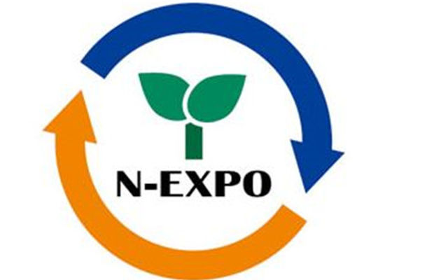
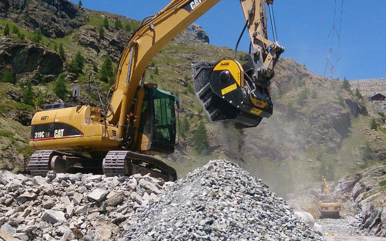
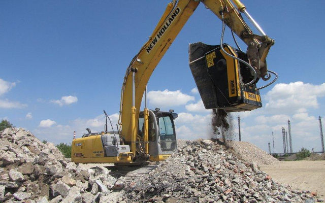

# MBジャパンはＡ１４２ブースにてMBアタッチメントを展示予定
イタリアに本社をおく世界的アタッチメントメーカーの日本支社、MBジャパン株式会社は今年も2017NEW環境展に出展します。2017 New環境展は５月２３日から２６日にかけて東京にて開催されるアジアで最大の環境展です。Ａ１４２ブースにてMBは現場作業を根本的に変えた、環境に配慮し多くのコスト削減をもたらす革新的なマシーンを展示します。

事実、MBアタッチメントの利用で人件費を抑えることができ（重機オペレーターは１人のみ）アタッチメント型クラッシャーの稼働は低燃費でメンテナンスも非常に簡単かつ迅速に行えます。“クリーニング”のプロセスがエコであるのは当然のこと、粉塵や騒音が最小限に抑えられることで環境への影響を小さくでき、環境に配慮した選択ができるのです。資材の再利用により建設業者は廃棄と運搬コストの削減ができ、時間と資金を節約することが可能となります。

更に、建設廃棄物や掘削物の廃棄に廃棄物処理場を利用するコストは近年急上昇しています。建物の取り壊しや都市部で掘り起こされた資材の保管やリサイクルはますます高価になりつつあります。将来的に都市部の建設現場で掘削された資材は“汚染された資材”と分類されるとさえ言われており、更なるコストの上昇も見込まれています。アタッチメント型クラッシャーはエコだけでなく経済面からもお客様のニーズにお応えします。

環境展では5種類のバケットクラッシャーが展示される予定です。

MB-C50: MBのラインナップで最少のモデルです。非常に狭いスペースで機敏であり、小規模な現場で効率的です。
BF70.2: 小中規模の破砕作業や都市部の現場に理想的です。
BF80.3: コンパクトで多様性があり、外部と建物内の双方にて破砕とリサイクルの両作業に理想的です。
BF90.3: 世界で初のバケットクラッシャーモデルです。建設業における最新のコンセプトを反映した必須の機材で、刃の噛合せ運動により現場にて資材を破砕することができ、コストと時間を節約できます。スクリーニングバケットの、MB-S10とMB-S14も展示予定です。両モデルともサイズ交換可能な内網を備えています。
そしてグラップルMB-G1200、交換可能な爪と360度の油圧ローテーションにより大容量な変形物も取り扱うことができます。

2010年のサービス開始より、MBジャパンは製品の販売と配送を迅速かつ効率的に行い、本社イタリアの専門知識と専門性を日本のお客様に直接お届けして参りました。現場にできる限り迅速にお届けするため、埼玉本社にバケットを常に在庫として保管しております。さらに、スペアパーツはオンラインシステムを活用し瞬時に倉庫から24～36時間以内に建設現場へお届け致します。