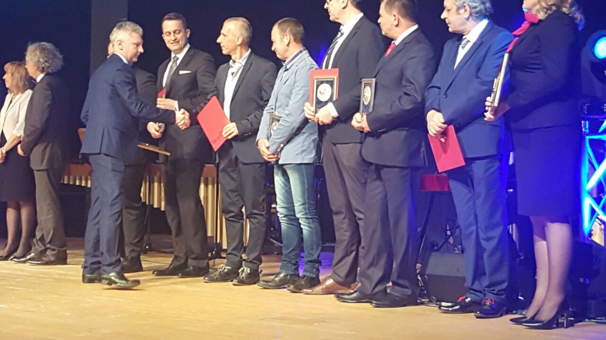
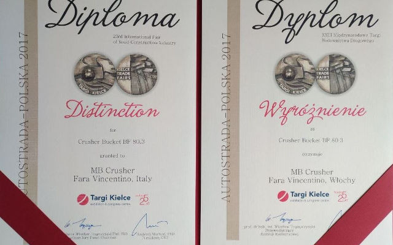

# ポーランド国際展示会にてBF80.3が特別賞を受賞
現場に次々とソリューションを提供し続けるMBクラッシャー。その勇気とパワーがまた高く評価されました。受賞したのは、MB Crusherの文字の入ったバケットクラッシャーBF80.3。ポーランドのキェルツェで5月9日～11日に開催された道路建設業に関する国際展示会Autostrada Polskaの展示会コンテストにおいて、そのイノベーションを認められ、特別賞を受賞しました。

9日に主催された晩餐会で授賞式が行われ、MB代表、および2010年設立のMBドイツ支店の経営陣が賞を受け取りました。

業界一幅広いラインアップを誇るMBクラッシャーの一つ、BF80.3は、18,5トンクラス以上の油圧ショベルに対応します。小さいながらも汎用性に優れ、極めて剛性な刃を持つBF80.3は、まさに破砕機そのもの。廃材を破砕してリサイクルし、再利用可能な新資材を生み出します。

バケットの重さは3トン、積込容量0,7m3。コンパクト（サイズ：2050x1300x1400mm）ながらも、1時間あたりの最大処理能力は34m3を誇ります。MBバケットクラッシャー全シリーズに共通のHardox in My Bodyで頑強なボディは、資材を取り込む際の摩擦を排除できるよう設計されています。小型なので、スペースの限られた現場でも楽々と作業を行えます。

現場の安全と環境保全への配慮、それに高い耐久性と処理能力を掛け合わせて出来たMB製品。その革新性と発想がキェルツェのコンテストで認められたのです。