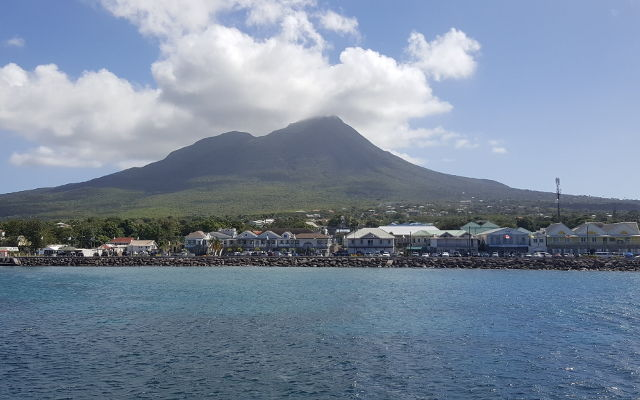
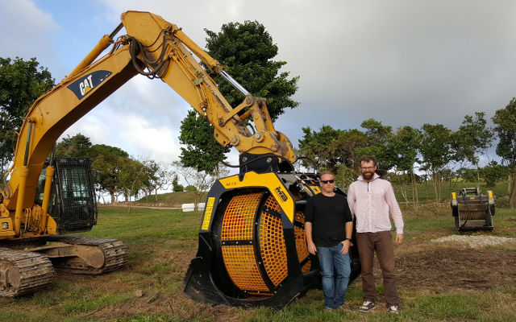
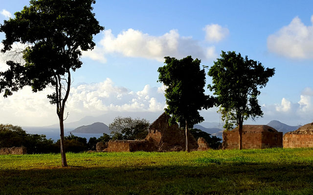
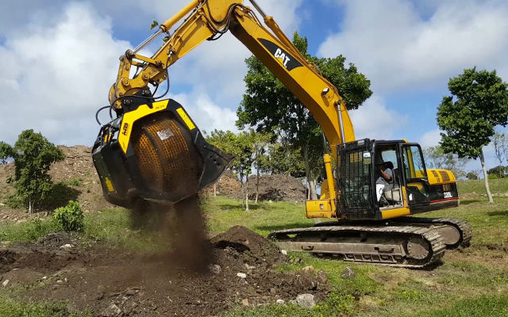
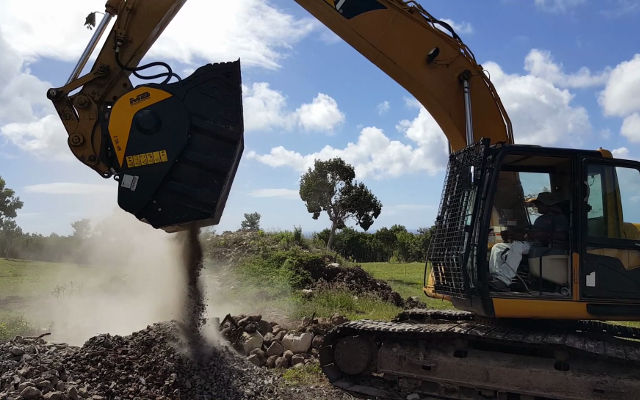

## プロジェクト詳細
地上の楽園を呼ばれるセントクリストファー・ネイビスは1493年にコロンブスによって発見され、コロンブスは自身の名前に由来した名前を島の一つにつけました。（セントクリストファー島）

コロンブスの発見から600年が経った現在、MBバケットクラッシャーとMBスクリーンバケットは島の自然と歴史を保護しながらネイビス島の再開発工事で活躍しています。

再開発プロジェクトは、蒸留酒製造所や教会等の植民地時代の古い建物の修繕・新しい建築物の増設・自然整備を目的としています。

## MB　ネイビスの自然と歴史を保護

MBスクリーンバケットMB-S18はキャタピラーの重機320Lに装着され、枝木の中から土を分けるのに使用されています。仕分けられた土は再度ネイビスの自然へ戻されます。この森の浄化は自然の復元に繋がっています。

また、MBバケットクラッシャーBF90.3は現地で掘削される硬度の高い火山性のネイビス石を破砕するのに使用されています。破砕後のネイビス石は、新たな建設予定地や道路の路盤材としてリサイクルされています。

## 自然保護を選び競争力を勝ち取る

MB製品を使用することで即座に経済的効果が得られます。さらに、MBは自然環境に配慮した製品なのです。運搬機材や燃料をカットしその場でリサイクルすることで自然を保護することになるからです。
<iframe width="750" height="422" src="https://www.youtube.com/embed/kPgnLYwXfcQ" frameborder="0" allow="accelerometer; autoplay; clipboard-write; encrypted-media; gyroscope; picture-in-picture" allowfullscreen></iframe>