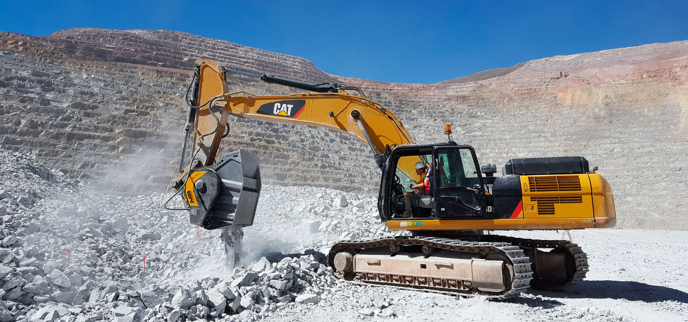

ペルーの採掘現場で、バケットクラッシャーBF120.4はキャタピラー336の重機に取り付けられています。BF120.4で破砕された骨材は様々な方法でリサイクルされます。

まず、破砕物は破砕作業による粉塵よけのために使われます。MBクラッシャーを使えば破砕物を適確なサイズに調整でき、 爆薬を使用する箇所をふさぐことができます。MBクラッシャーで破砕した骨材を現場で即座に利用することで作業が飛躍的に効率的になります。また、バケットクラッシャーBF120.4で破砕された骨材は採掘現場の路盤材としても使用されトラックや重機の作業を安全にそしてスムーズにしています。  現場で発生した骨材をその場で再利用でき、コストと時間の削減を可能にするバケットクラッシャーは採掘場に大きな利益をもたらします。