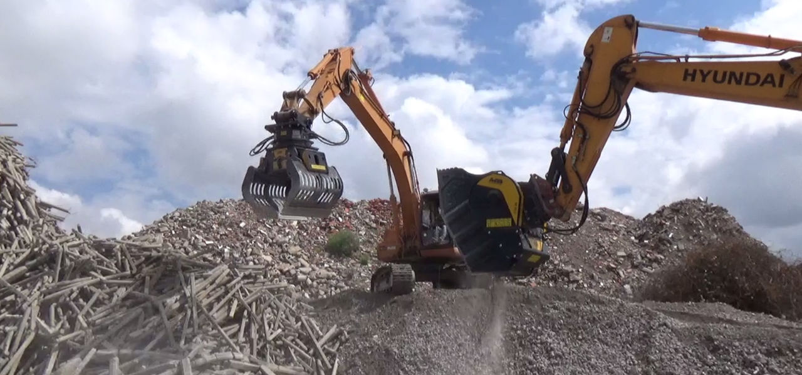
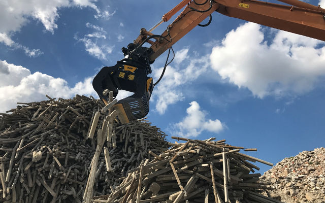
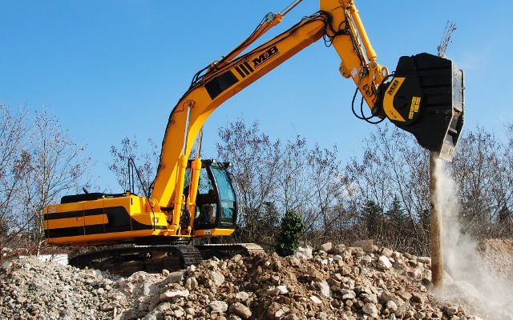

# 農家にとって季節の変化はとても重要です。 MB製品を使えば、ムダを省き一年中利益を産むことが できます。
農家にとって季節の変化はとても重要です。 MB製品を使えば、ムダを省き一年中利益を産むことが できます。
フルーツ栽培やブドウ園で鉄筋コンクリートの柵は実用的に使用されています。しかし、栽培地の変換や移動の際にはこのコンクリート製の柵はしばしば問題となります。

柵の撤去は複雑で農家にとって悩みのたねでもありました。まずゴミとして廃棄するには費用がかかり、行政の厳しい指導もあります。古くなった柵は環境に配慮した持続可能な方法で処理されなくてはならないのです。

ではどうやってこの柵を環境に配慮した方法で処理できるのか。MBクラッシャーは本社のあるイタリア・ベネト地域にある複数のぶどう農家とMBバケットクラッシャーの適応テストを行いました。MBバケットクラッシャーはすでに線路の枕木 や電柱などのかさばる資材を破砕し成功していました。ぶどう園や果樹園にあるコンクリート製の柵も破砕できるはずです。

しかし、今までの破砕物と違ったのは高強度のワイヤーが組み込まれた支柱ということでした。バケットクラッシャーの破砕中にワイヤーがひっかかりコンクリートを破砕できないのでは、という懸念がありました。

結果、実験の成果は数分で出ました。バケットクラッシャーは高強度のワイヤー入りコンクリート柵を行政の規格内で、しかも持続可能な方法で破砕できたのです。一方、従来の固定式クラッシャーやモービルクラッシャーではワイヤーがベルトコンベアーを裂いてしまい、作業の中断や修理費がかさみ使用できません。

それ以来MBクラッシャーは農業分野でも欠かせない存在となり、いまではMBの複数の機械を使う事で農家の働き方を劇的に変えました。 グラップルで柵を集めて束にし、バケットクラッシャーはその場で柵を破砕し小さな骨材へと変えることができます。

また、特許取得のマグネットを装着すればコンクリートの中から鉄くずだけ取り出すことができます。コンクリート資材は別の場所や新たな方法で使用できます。枕木や電柱と同じように、ワイヤー入りコンクリート柵もただの産業ごみではなくなり、再利用や販売できる骨材となったのです。精度の高いサイズ調整で骨材の大きさも均一になり、廃材だった柵は新しい製品となりました。