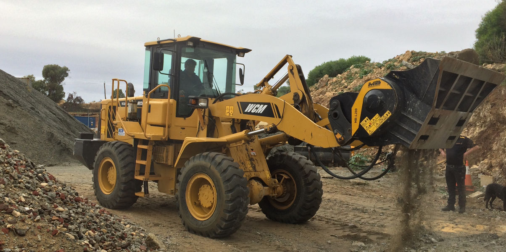
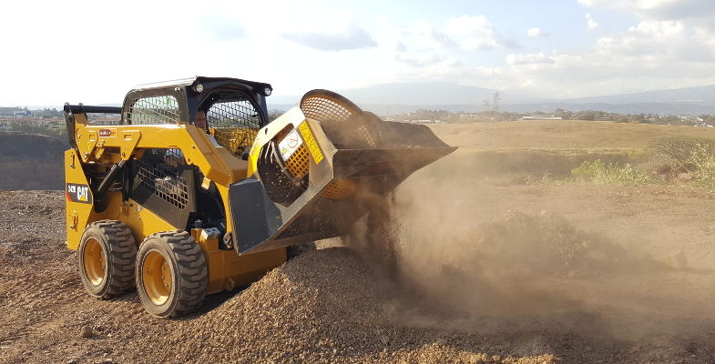
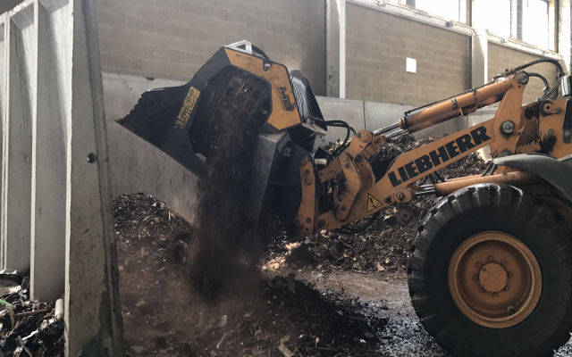

# 廃棄しなければならない現場から発生したガラや土はMB製品によって環境に配慮した価値ある資材に生まれ 変わります。
廃棄しなければならない現場から発生したガラや土はMB製品によって環境に配慮した価値ある資材に生まれ

変わります。MBはショベルカーやスキッドローダー、バックホウローダーを本物のクラッシャーに変身させる先駆者です。
MB-LバケットクラッシャーとMB-LSスクリーンバケットは2.4トン〜25トンまでのスキットローダーやバックホウローダーへ取り付けられるサイズ展開です。油圧ショベル用のバケットクラッシャーやスクリーンバケットと同様、現場で大活躍します。
MB-LとMB-LSの利点は、人件費を大幅に抑えられるという点です。たった1人のオペレーターで全ての作業ができます。また、時間と経費も削減できます。処理場に運んだり、新しく骨材を買い直す必要がないからです。次に、現場での利便性が挙げられます。MB-LとMB-LSはコンパクトなため、小さな現場や屋内での使用が可能です。最後に、MB-LとMB-LSを使用することで環境保全に繋がります。現場でのリサイクルを可能にするため運搬の際に発生する排気ガス等を防ぐことができるのです。

【美しいプロポーションと利便性】

MB-LとMB-LS はスキッドローダーとバックホウローダーに取り付けられ、重機側の油圧システムを使って作動します。
MB-Lは解体や掘削で発生したガラを集め、様々なサイズに破砕することができます。
MB-LSは様々な現場から発生した物質をサイズ別に仕分けることができます。分別された骨材は配管工事や路盤材などに利用でき、販売することも可能です。
全てのMB-LSモデルの内網は網目のサイズを交換することができます。また、MB-LSの美しいフォームは時間あたりの処理量を最大限に上げるべく設計されました。全てのMBシリーズ同様、MB-LとMB-LSも100%メイドインイタリーの高い品質管理の元作られた機械です。

【解体現場から焼却炉まで】

様々な分野の現場でMB-LバケットクラッシャーとMB-LSスクリーンバケットの活躍をみることができます。
土壌改良工事で土を分別しています。
パドバにあるリサイクル施設では鉄の分別が行われています。
多くのお客様が解体現場でお使い頂いています。
配管工事や海岸工事、あらゆる公共工事でも活躍しています。
MB-LとMB-LSはサイズが小さいため、処理場にて金属やスラグを扱うのにも適しています。分別後には販売したり高価に買い取ってもらうことができます。

【推奨重機サイズ】
MBでは油圧ショベル、スキッドローダー、バックホウローダーに取り付けられる幅広いラインナップのクラッシャーとスクリーンバケットをご用意しています。

MB-L バケットクラッシャー

- MB-L120: 2.8トン以上のスキッドローダー、5〜7トンのバックホウローダーに取り付け可能
- MB-L140: 3トン以上のスキッドローダー、6〜8トンのバックホウローダーに取り付け可能
- MB-L160: 4.5トン以上のスキッドローダー、7〜10トンのバックホウローダーに取り付け可能
- MB-L200: 6トン以上のスキッドローダー、7〜10トンのバックホウローダーに取り付け可能

MB-LS スクリーンバケット

- MB-LS140: 2.6トン以上のスキッドローダーに取り付け可能
- MB-LS170: 6.5〜11トンのスキッドローダーに取り付け可能
- MB-LS220: 12〜25トンのスキッドローダーに取り付け可能

<iframe width="750" height="422" src="https://www.youtube.com/embed/9rJUDASRQN4" frameborder="0" allow="accelerometer; autoplay; clipboard-write; encrypted-media; gyroscope; picture-in-picture" allowfullscreen></iframe>