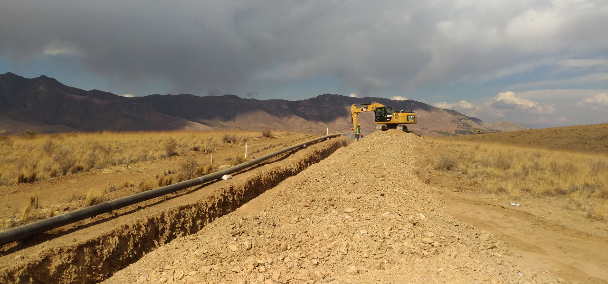
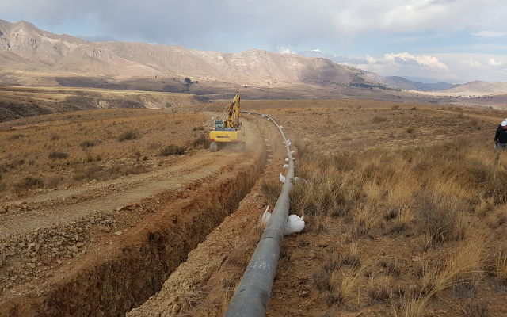
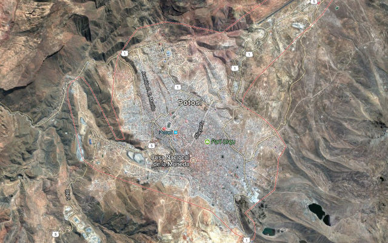
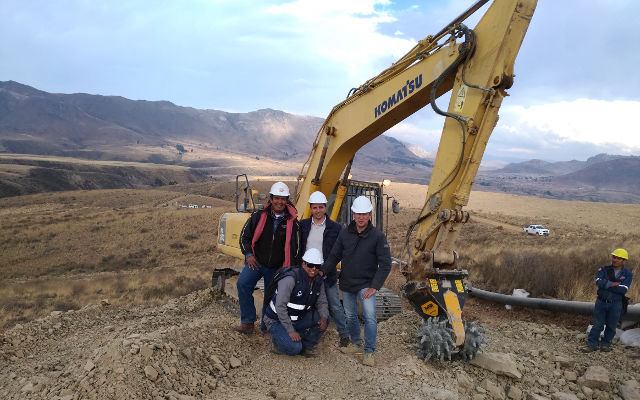
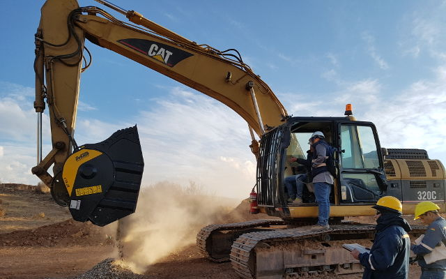

## MB-R800  ボリビア 標高4000m の都市にて

## 価値ある都市 ポトシ
ボリビアの都市ポトシは今でも「大変価値のあるもの」を表す代名詞として使われています。ポトシの街を見て元鉱夫たちの話を聞けば、ポトシがかつて世界有数の美しい巨大金鉱であったことがうかがえます。またポトシは人が暮らす都市としては世界最高の標高4090mを誇ります。1987年には世界遺産に登録され、現在も錫(すず)の採掘が行われています。

## セクレ〜ポトシ間パイプラインプロジェクト
その標高4000m以上の地でMBツインヘッダーは巨大なプロジェクトに参加したのです。ボリビアの都市セクレとポトシのガス供給パイプラインの拡張工事です。セクレ・マリアカとポトシ・カラチパンパの間57キロにも及ぶ工事です。この工事が成功すればポトシに天然ガスを十分に供給でき商業や産業の活性化に繋がります。

<iframe width="750" height="422" src="https://www.youtube.com/embed/gpmr8QGikMk" frameborder="0" allow="accelerometer; autoplay; clipboard-write; encrypted-media; gyroscope; picture-in-picture" allowfullscreen></iframe>

## どんな状況でも活躍するツインヘッダー
MBツインヘッダーはコマツPC２００の重機に取付け工事に使用されました。ツインヘッダーの砕く対象物は石とみかげ石の混合物で非常に固く、また地理的にも難しい現場でした。アンデス山脈の中にありマイナス8度まで下がる極寒の中で工事は行われました。

そんな過酷な状況でもMBツインヘッダーは従来の力を発揮しました。それが100% メイドインイタリーが誇る品質です。MBツインヘッダーは、油圧ショベルのパラメーターが正常に作動しなかった場合のセキュリティーシステムを搭載しています。

また様々な強度の材質を砕く際、それぞれに適したパワーを自動的に使い分け破砕することができ、油圧ショベルのアームへの負担を減らし作業を確実に遂行することができます。

2枚のドラムは現場で取り外すことができ、特許取得のツインモーターシステムは2つの刃にそれぞれ力を供給することができます。また現場ではMBバケットクラッシャーBF80.3も活躍しました。

ツインヘッダーが砕いた石をさらに破砕しパイプライン工事で再利用したのです。

## MB-Rについて
MB-Rツインヘッダーは3モデルあります。MB-R700は最小サイズで6トン〜13トンの重機に取付可能です。MB-R800は重さ1トン、10トン〜22トンの重機に取付られます。最大サイズのMB-R900は19トン〜35トンの重機に取付可能です。