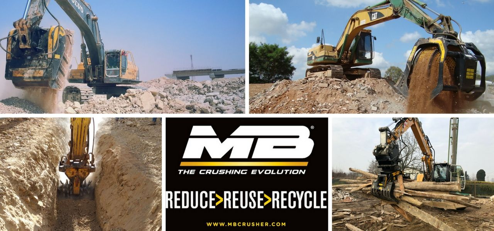
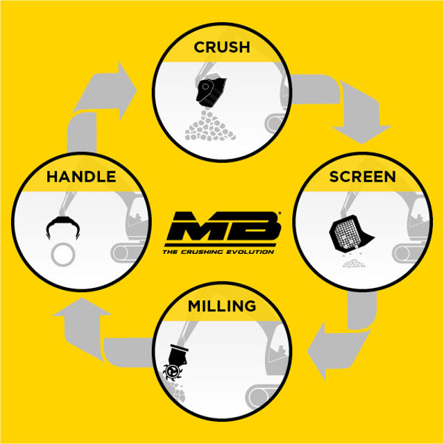
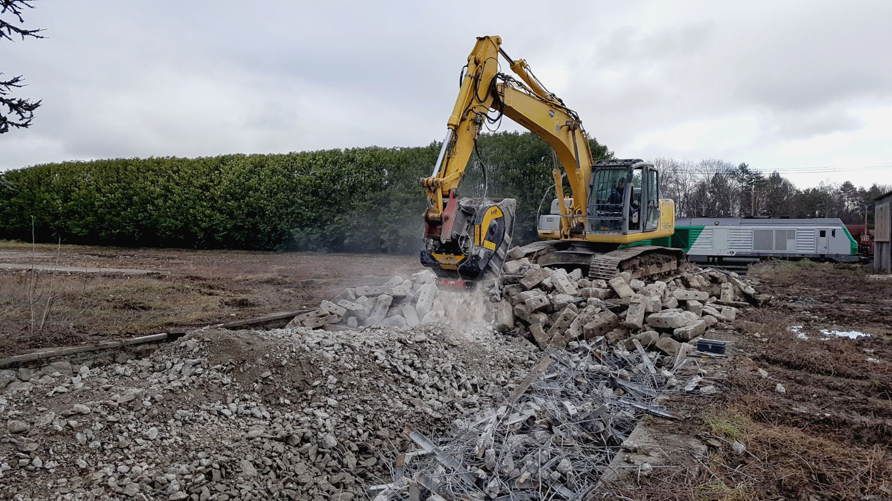

# 私たちの地球が支えきれないほどに増え続ける負担、そして企業や自然が手にすることのできる 経済的な節約と環境保護との関係。
それは世界で7番目に重要な資源です。自然に対して何も求めることなく、他のニーズを満たすためのニーズ。リサイクル とは、単なるチャンス以上のものなのです。今日では 人々や環境、そして企業にとってソリューションとしての価値がますます高まっています。

2018年3月18日 世界中が、初めての世界リサイクルの日である グローバル・リサイクリング・デーに参加します。 世界中でリサイクルの支援に日々尽力しているMB Crusher 社も、この活動に参加します。

今日、建設や解体から出る 廃棄物 は、ヨーロッパで産出される ごみ全体の約  30%  を占めています。ヨーロッパでは多くの国が企業にリサイクルを義務付けるために法律を制定しています。そして大西洋の向こう側では、コロンビアのように、リサイクルの実践によりごみの割合を減少させることを目的とした法律が定められています。

管理されずに蓄積し続けている不活性物質は、地球にとって 支えきれない負担 となっています。企業の義務は環境と人の権利を尊重するために、自らが出す廃棄物の負担を担うことです。

今なら、そのための解決策があります。リサイクルのために破砕し、節約するために投資することです。MB Crusherの 破砕バケット は、掘削屑や掘削物質を産出現場で破砕します。したがって、企業は現場から埋め立て地までの物質の輸送を 削減 できます。ますます多くの自治体で課されているトラックの通行制限を順守

できます。さらに環境を汚染しないことから環境に優しく、資源を利用しません。

レンガ、コンクリート、モルタル、凝灰岩、大理石。破砕バケット MB Crusherは、現場のニーズに応じて、様々なサイズに石を破砕します。その後、バケットに設置されている鉄除去装置が、それらを鉄から分離します。また作業中は、作業員のために ネブライザー が破砕時に出る埃を低減します。選別機能のついたバケットMBを使用すれば、物質から余計なものが取り除かれ、再利用できる状態になります。または、破砕前に選別を行うと、作業時間が60%短縮されます。

こうして解体廃棄物は、現場で新建造物の基礎への埋め込みや配管の掘削、路面、庭園の装飾などに活用できる 生産的な資源 となるのです。また現場での用途がない場合には、商業資源として、他企業へ販売することもできます。

だからこそ、リサイクルは最も重要な 第7の資源 となるのです。累進する地球の 疲弊 を止めましょう。そして、不活性物質はあらゆる生産に利用できる真の資源であるという考えを世界中で提起しましょう 。グローバル・リサイクリング・デイがこの原則の証です。

## リサイクルが重要だからこそ、3月18日への参加が重要なのです。