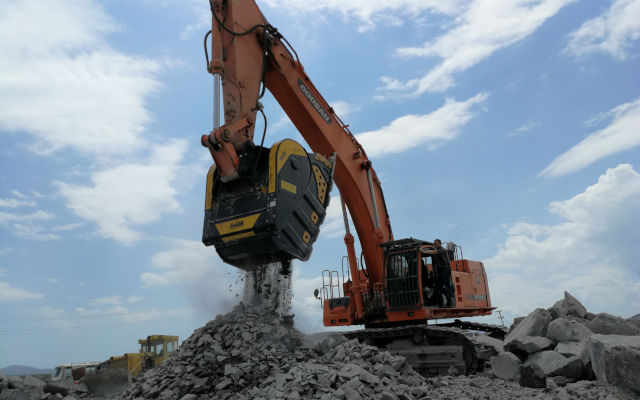
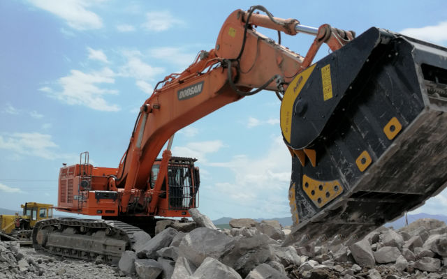

採石場へのアクセスが不便な場合、機械と資材を輸送するのに簡単且つ経済的に有効な手段を探さなくてはいけません。

私達のあるアルメニアのお客様が強かな選択をしました。

<iframe width="360" height="203" src="https://www.youtube.com/embed/kIaFwPYJd4A" frameborder="0" allow="accelerometer; autoplay; clipboard-write; encrypted-media; gyroscope; picture-in-picture" allowfullscreen></iframe>
世界で一番大きいBF１５０.１０ バケットクラッシャーをご購入頂きお客様がお持ちのDoosan DX700LC に取り付けられました。

そうです、バケットクラッシャーを油圧ショベルに取り付けたのです。それは高品質なMB製のバケットクラッシャーだったのです。

余分な輸送は不要で直接、現場にて作業員が油圧ショベルに乗ったまま硬い岩石を破砕する作業が可能となりました。

ですのでトラックが粉砕された岩を何度も運び現場を出入りするといった事が不要になりました。

今となっては一連の作業は全て現場で賄える事が可能になったのです。そればかりか粉砕された土砂を再利用する事も出来ます。

皆さん、素晴しい事ではありませんか！