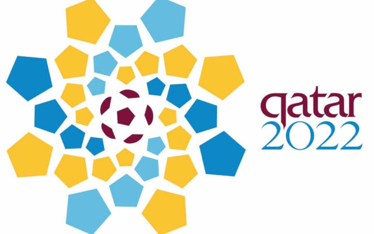
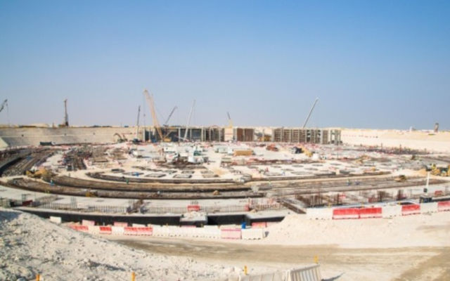
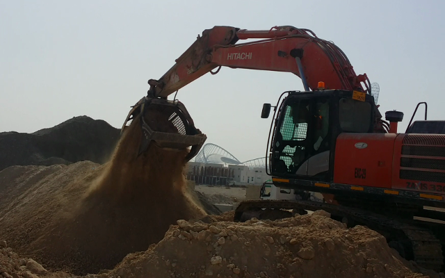
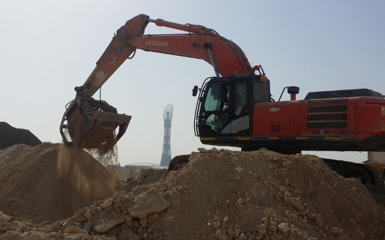
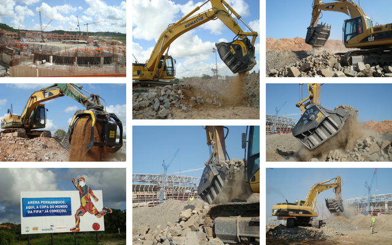

# カタールの首都　ドーハの道路建設現場でMB-S18 スクリーニングバケットが作業。
サッカーワールドカップ ロシア大会が終わり既に次回 2022年開催のカタール大会に向けてMB Crusher が稼働し始めてます。

実際には次のサッカー大会を見込んでプロジェクト、インフラ整備に1,000 億ドル以上が投資に費やされました。 カタール国内外の建設会社に大きな収益をもたらすチャンスが到来しています。

このプロジェクトに参加している有名な建設会社はMB-S18 スクリーニングバケットを使用しながら作業を行なっています。

新スタジアムの建設は総合複合施設として建設が進められており45,330席の設置が予定されています。
<iframe width="360" height="203" src="https://www.youtube.com/embed/QTyjcxwPDPo" frameborder="0" allow="accelerometer; autoplay; clipboard-write; encrypted-media; gyroscope; picture-in-picture" allowfullscreen></iframe>
実際には日立の油圧ショベルに取り付けられたMB-S18 スクリーニングバケット1台のみで期待以上の成果(労働時間の短縮、人件費の抑制等)を上げ作業を行なっています。

粗い部分は砕かれ細かい部分は砂と一緒に使用されました。

このおかげで建設会社は実車の保有台数を減らす事に成功し多大な出費が抑制されています。現場は大きな作業所から約50キロ離れており以前は移動の際、交通渋滞に悩まされておりました。

しかしながらMB-S18 スクリーニングバケットを使用し始めてから移動する必要がなくなったのです。何故なら掘削された材料を現場で直接処理し再利用する事により処理時間、燃費、移動費を大幅に削減する事に成功したからです。

材料の購入額と処分に掛かるコストの削減が出来ました。

MB-S18 スクリーニングバケットは既にサッカーワールドカップ 2010年ブラジル大会に使用されその実績を買われ2014年南アフリカ大会にも使用されました。

大会に関してまだまだ多くのプロジェクトが進行中です。　例えば320kmの新しいメトロネットワークの建設や全てのスタジアムと高速道路の接続など。

## 競争力を培うには適切な設備を選択をされた方だけなのです。