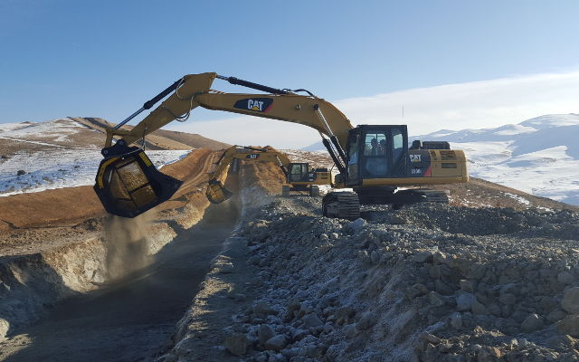
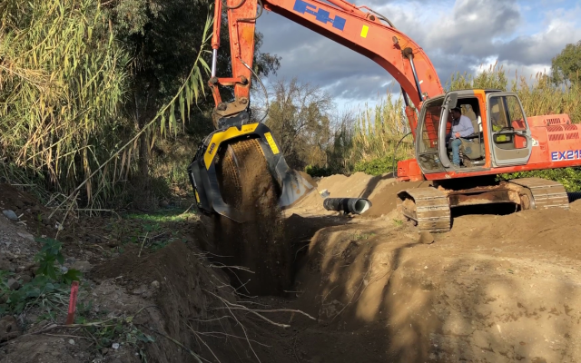

# MB社製品のバケットクラッシャーとスクリーニングバケットが溝堀の作業に使われ作業が一段とアップ
今や世界ではネットに接続しないと社会から除外されている錯覚を感じます.
ガス、電気、水道、電話回線等は正しく日常の生活には欠かせないものとなっています今日では誰でも簡単にネット回線に接続可能でコミュニケーション, 移動手段, 運輸等はとても便利になりました。
私たちの住んでいる街の地下に目を向けると無数のガスパイプがまるで人間の体の血管の様にひしめいています。

今, 世界では新たなガスパイプライン, 水道管等設置の為に溝堀があちらこちらで進められています。 往々にして巨大な事業,或いは孤立した場所で数キロにも及ぶ道路の事業を手掛ける必要があります。
現場で重機を使いパイプを敷き詰める為に何キロも掘らなければなりません。 通常はパイプの敷設, 骨材を置くスペースを確保する為に大型のクラッシャー機, または選別するプラントが現場の近くに設置されます。 しかしながらそれが可能でない場合もあります。 それは現場へのアクセスの問題が生じたり, 廃材を他の場所へ運搬し処理する時間と大幅なコストの問題が発生します。

これらの問題を解決してくれるのがMB社製のバケットクラッシャーとスクリーニングバケットです。 特徴は現場で直接取り付け可能だという点で骨材を運搬する必要がなくなる為, 運搬コストを抑制出来ます。骨材を細かくし選別する事によって作業の効率が上がります。

## では世界の例をみてみましょう
トルコでは約700キロにも及ぶ天然ガスパイプライン建設の為, 13台ものスクリーニングバケットが使われました。 現場で骨材をバケットで選別する為, 他の場所へ運搬して作業するといった様な事が無くなり作業時間の短縮に繋がったのです。

<iframe width="360" height="203" src="https://www.youtube.com/embed/gWb97neYoTU" frameborder="0" allow="accelerometer; autoplay; clipboard-write; encrypted-media; gyroscope; picture-in-picture" allowfullscreen></iframe>

<iframe width="360" height="203" src="https://www.youtube.com/embed/46aL0IgH0cg" frameborder="0" allow="accelerometer; autoplay; clipboard-write; encrypted-media; gyroscope; picture-in-picture" allowfullscreen></iframe>
アルゼンチンでも同様で天然ガスと原油輸送の大型プロジェクトを担う企業はMB社製のBF90.3バケットクラッシャーと MB-S18スクリーニングバケットを使う事にしました。 2つのアタッチメントは重機に取り付けられバケットクラッシャーは骨材を破砕して細かくし, スクリーニングバケットでそれらを選別しました。

何故この様な選択をしたのでしょう？
彼らは時間はお金に匹敵する事を知っていたからです。 たった1台の重機に取り付けただけで作業時間の大幅な削減に成功しました。

スペインでも街の中心から遠く離れた場所で水道官を設置する事業があり MB社製のバケットクラッシャースクリーニングバケットが活躍しました。 この2つのMB社製品は必要とされている目的を完璧に成し遂げたのです。

<iframe width="360" height="203" src="https://www.youtube.com/embed/9rdKnW4DVcw" frameborder="0" allow="accelerometer; autoplay; clipboard-write; encrypted-media; gyroscope; picture-in-picture" allowfullscreen></iframe>

<iframe width="360" height="203" src="https://www.youtube.com/embed/gpmr8QGikMk" frameborder="0" allow="accelerometer; autoplay; clipboard-write; encrypted-media; gyroscope; picture-in-picture" allowfullscreen></iframe>
現場から離れている場合は特に破砕機, 選別機のメンテナンスには時間とコストが掛かります。 MB社製品のメンテナンスは作業現場で出来てしまうのが強みです。現場を携わっている作業員の方でも出来ます。 ツインヘッダーのドラムは直接現場で取り外しが可能なので余分なコストが掛からず時間のロスもありません。

ボリビアで街の中心から遠く離れたアンデス山脈付近で標高4000メートルを越える高地で溝堀の作業でMB製のツインヘッダーが活躍しました。

MB社の製品はあらゆるニーズに合わせて設計されています。MB社の製品を使う人は自然環境と向き合いながら作業を実行しているのです。