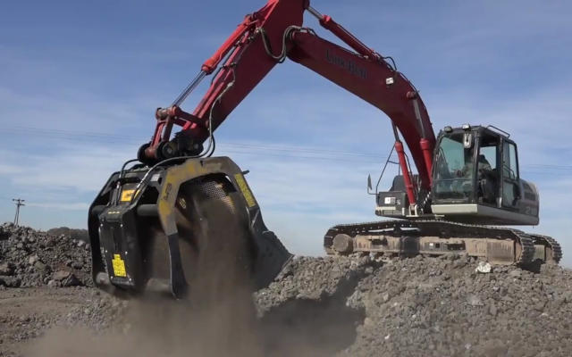

# 鋳造業界の中でも、鉄くずやその他金属などのスクラップを回収・リサイクルし、新たな資材として生まれ変わらせることで処理コストを利益に変換させることのできる鋳造所は発展し続けます。​

今日、環境保全及び産業廃棄物の環境負荷低減への取り組みという観点では、鉄鋼業界、中でも鋳造所が第一線にあると言えます。毎年、何百万トンという莫大な量の特殊廃棄物が処理されていますが、そこにかかる人材・設備、またコストも同じく膨大です。

「我々の業界の関連記事が経済新聞の第一紙面を埋めることは、あまりないかもしれませんが、現在に至るまで、世界各国のそれぞれの国の経済成長を担ってきているのはこの業界だ、と言っても過言ではありません。産業界においては大事な鍵を握るとても重要な業界なのです。廃棄物処理に関する喫緊の課題は、莫大な処理コストをどうするかということです。中小企業も大企業も、廃棄物の保管や運搬、選別や破砕、そして廃棄処理にかかる莫大な費用を各々で負担しなくてはならないのです。」

このような同業界の事業者らの意見に耳を傾けることで、５つの各大陸に拠点を置くMBが気づいたのは、国は異なっていても最優先すべき課題・目標は同じである、ということ。 それは、廃棄処理コストの削減です。

不要なものを利益に変える。 これは、MBの企業理念です。MBが提案するソリューションは、このミッションと重なります。 2002年に初代MBバケットクラッシャが特許を得て以来、お客様がすでに所有する物を最大限に活用することで価値を生み出せるよう、自立性の高い商品を提案・提供することにより、MBは常に各企業に寄り添ってきました。

「お客様によくお話しするのですが、私たちMBは、スポーツ界で言えば、スポーツ選手をサポートするトレーナーに近いものがあります。各選手が持つ資質や潜在能力を見極め、それを活かすことで、最大のパフォーマンスを引き出し、選手を勝利に導く。遠くに答えを求める必要はないんですよ。コスト削減のために活用するだけでなく利益まで増やしてくれる資材がすでに存在しているのは、鋳造所そのものなのですから。いいことずくめです。」

こう言ってMBが提案するソリューションの高品質と高性能は、MB研究開発部により保証済み。MBバケットクラッシャーおよびMBスクリーニングバケットは、鋳造所の資材を最大限に有効利用できるよう設計されています。

再使用不可能な鋳型や中子から発生するスラグや砂はもちろん、鋳鉄、鉄鋼、軽金属、非鉄金属のスクラップが生産される所でならどんな場所でも、MBバケットクラッシャーが活躍します。敷地内や施設内で処理をすることで、資材のリサイクルの全工程を完全管理する役割を担います。コンパクトで抜群の操作性を備えたMBシリーズは、屋内でもスペースの限られた場所でも使用できるよう設計されています。

「MBバケットクラッシャーとMBスクリーニングバケットは、他のアタッチメントと同様、重機に直接スピーディーに取り付けられます。鋳造工程で揚がりや湯口、押湯などに発生するあらゆるスラグは、破砕され、ふるい分けられたのち、即時に再び生産サイクルに取り込まれます。このようにしてスクラップが再利用可能・販売可能な商品に生まれ変わるのです。このことは、数値をみれば明らかで、スクラップの85％以上は、回収して再利用することが可能です。そして、処理コストの代わりに、生産面や経済面での利益が生み出され、環境負荷低減効果も高まります。MBバケットクラッシャーとMBスクリーニングバケットを使用することにより、工場内での作業は、各々の企業にとって最も効率的な作業方法を採用し時間管理をすることができます。例えば溶解炉が運転停止している時間を有効に使うことも可能です。」世界各地の加工工場における経験をもとに、MB研究開発部は自信を持って言い切ります。

MBの目標は、お客様のビジネスをスピードアップさせるアクセルとなることです。MBスクリーニングバケットは、大量の鉄材でも効率的に短時間で分別し、多様な用途別の質の高い再生材を提供します。現在では、建築工事や道路の基礎工事等の現場で、生産量が減少してきている採石場の資材よりも再生材のほうが必要とされるようになっています。

MBでは、待機時間はゼロに等しいと言えます。それは、MB製品の生産プロセスに関してだけでなく、カスタマーサービスについても同様です。一年３６５日、一日２４時間体制でサポート対応致します。お問い合わせやご質問にも迅速にお答えし、お客様にとってのメリットおよびコスト等、費用効果のご相談にも素早く対応できるよう、世界各地に専門技術スタッフを動員してサービス体制を整えております。また、ご要望にお応えしお客様のところまでお伺いさせていただきます。

MBバケットクラッシャーとMBスクリーニングバケットは、コストを「破砕」し、不要なものを利益に変える使命を全うするために、お客様が必要とされるならば、世界のどこまでも、またどのような過酷な条件下の現場へもすぐに飛んでいきます。世界各地でMBをご使用くださっているユーザーの皆様がこの事実を証明してくださっています。

<iframe width="230" height="129" src="https://www.youtube.com/embed/XxZjF0HRImI" frameborder="0" allow="accelerometer; autoplay; clipboard-write; encrypted-media; gyroscope; picture-in-picture" allowfullscreen></iframe>

## 鉄くずの回収・リサイクルに使用されるスクリーニングバケット MB-LS170
大規模なリサイクル施設で、スクリーニングバケットMB-LS170がリーブヘル514のローダーに取り付けられ、細かな鉄くずから大きいサイズの鉄くずを選り分けています。事前に分別しておくことでリサイクル機械に挟まって機械が停止してしまったり、機械にダメージを与えたりすることが避けられます。結果的にこのようなアクシデントによる効率の低下や時間の浪費を回避できます。
<iframe width="230" height="129" src="https://www.youtube.com/embed/IUAgxx-RSfk" frameborder="0" allow="accelerometer; autoplay; clipboard-write; encrypted-media; gyroscope; picture-in-picture" allowfullscreen></iframe>

## バケットクラッシャー MB-L200
20分も経たないうちに、リサイクル可能な資材が誕生。MBバケットクラッシャーを使用せずに作業した時に比べ、大幅な時間削減が可能になったと同時に分別済みの資材の質も向上しています。コストの削減と利益増大に成功！
<iframe width="230" height="129" src="https://www.youtube.com/embed/M_n4uDnD3gg" frameborder="0" allow="accelerometer; autoplay; clipboard-write; encrypted-media; gyroscope; picture-in-picture" allowfullscreen></iframe>

## MBバケットクラッシャー BF90.3
MBバケットクラッシャーの威力をご覧ください！Cat油圧ショベルに取り付けられたMBバケットクラッシャーが極めて硬い鉄くずを破砕しています。バケットクラッシャーBF90.3は、どんなに硬いスクラップでも破砕できるようタフに設計されており、高いパフォーマンスと耐久性を誇ります。