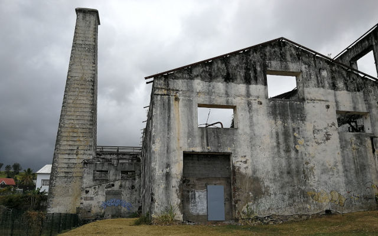
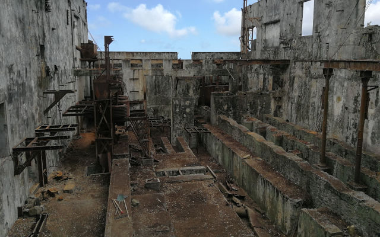
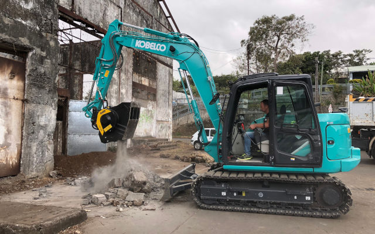
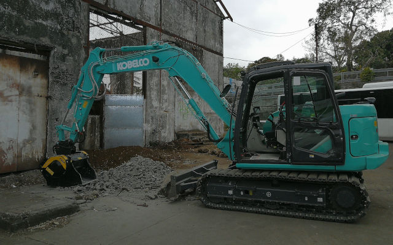

# フランス領レユニオン島にてミニショベル用バケットクラッシャーが歴史的な砂糖工場の再開発に一役
レユニオンはインド洋マスカリン諸島に浮かぶ火山島です。　海外のフランス領内の仕事の中でもっとも”スウィート”な仕事です。

ラセイラインヌの中心ヴーベルには1874以前に建てられた歴史的な砂糖工場があり島の経済の中心地として栄えましたが1969年には生産需要に対応出来ず工場は閉鎖されました。

それ以来、建物には草木が覆い茂り投棄物が後を絶たず放置されたままになっていました。 当然、この様な振る舞いがなければ今でも価値のある工場として存在していた筈です。数ヶ月前、島の責任者は利用されていない工業地区の開拓に着手し文化的、経済的に地域社会の財産となる様に推し進めました。

今日に至ってもレユニオンでは砂糖産業は経済の重要な部分に位置し18300人以上の雇用を生み出しています。　サトウキビの原材料の主要でない部分からは絞り汁からラム酒、エタノール、泡から肥料、家畜の為の飼料を生産等、重要な役割を果たしています。

ですのでサトウキビには無駄になるものはありません。産廃の再利用を促進し資源を大地に戻すという様な考え方はMB社の哲学と重なるものがあります。

利用可能なリソースを最大限に活用する事を知っています。

コベルコ機にバケットクラッシャーMB-C50を取り付け古い工場から発生した産廃を一掃し安全を確保しました。 主要な目的は建築物に簡単にアクセス出来る様にし、地域の発展に繋げる事でした。

ラセイラインヌの地における砂糖工場を復活させる開発プロジェクトが進みバケットクラッシャーは現場で直接、レンガ、鉄筋コンクリートを破砕しガラを適切なサイズに加工しました。　公立学校、市営プールの傍に人々の活動の障害になるものはありません。それはMB製品は騒音が少なく埃が抑制される様に設計されており環境保全に役立っているからです。

昔の面影が漂っているのは好いものです、それが文化的、経済的に価値のある建物を再利用するという事であれば尚更です。　開発に力を注げば新たな富が構築出来ますが、もしMB製品を使って推進するのであればより一層価値が増すでしょう。