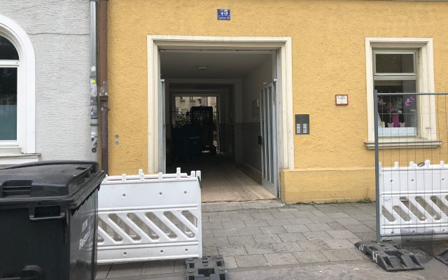
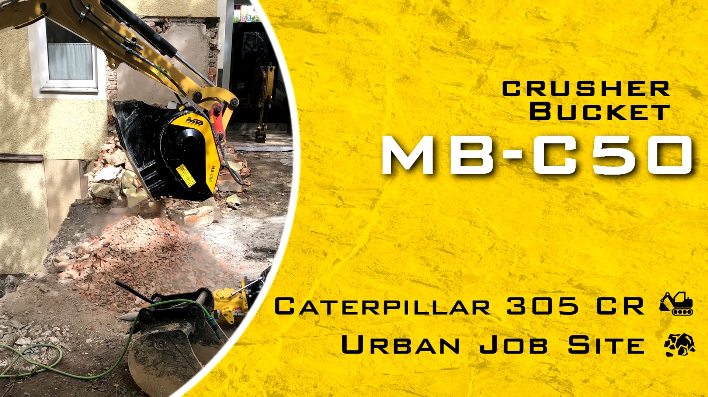
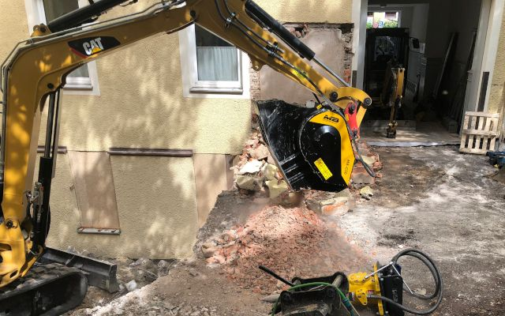

# バケットクラッシャーMB-C50がドイツ、バイエルンの宮殿内で作業
バイエルンにあるフランジスカナー通り45番地、大戦中に人々は見つからない様に地下トンネルを通って近隣の建物に避難していました。

既に1700年代には脱出用のトンネルが掘られていました。

今日でも未だトンネルは存在しますがその上には新たなビジネスに対応する為に現代的な建物、住居、お店等が建設されました。

一方で市内中心部では建物を拡張することは駐車場、歩道といったものがあってスペースに限りがあるので中庭を利用し作業が行われました。

そんな中、改築を得意とするあるドイツの会社は建物の新しい部分を建設する為に中庭の一部を解体し基盤の作成に取り掛かりました。

本来、もっとも気を使わなければいけなかったことは近隣の住民に迷惑を掛ける事無く短時間で安全に作業現場を管理する事でした。それと合わせて狭い出入口を通って作業に使う機械を運搬しなければいけない、埃や騒音をたてられない、振動を極力抑える、掘削によって発生した材料の管理、コストの抑制をしながら短期間で作業を完結しなければならない等、色々な問題に直面しました。最大限の効率、最小限の無駄。

## どうやって？
# 物流管理と現場の安全。

バケットクラッシャーの姿が見えません。　でもそっとしておきましょう。
中庭自体は小さく入り口は狭い。この作業現場で対処出来たのがのキャタピラー製　5トン用のミニショベルでした。

不活性物質で何をすべきか？　ミニトラックに積みリサイクルセンターへ運搬し加工後、再度運搬し中庭で新しい基盤作りに利用する事でした。

ですが加工した材料を再度、運搬するにはトラックは何台分必要でどのくらいのコスト、また時間が掛かったのでしょうか？
もし実現させようとしたら運搬の頻度が多くなり、また費用が高く付くだけでなく交通規制の掛かった市街地を通ることは非常に困難を来すのが現実です。

## 解決策は？
ミニショベルにバケットクラッシャーMB-C50を搭載し作業を行いました。MB製のバケットクラッシャーでしたら現場で取り付け出来るので直接、作業が出来ます。　ミニショベルのアームを頻繁に動かすなど不要で安全性も向上されます。 従ってトラックによる運搬が不要となるだけでなく現場で作業するオペレーターが加工材料の大きさを調整することも可能となります。

バケットクラッシャーMB-C50はミニショベルに搭載されている為、輸送コストが掛かりません。小さくコンパクトなので通り抜け出来ます。

# 環境に配慮し地域住民に迷惑を掛けません。

埃、　騒音等環境等に問題が生じるので誰も自分が住んでいる家の傍には工事現場は存在して欲しくないと願っています。　振動においては建物の根幹を揺るがしかねません。

バケットクラッシャーMB-C50には埃対策の為、噴霧器が装備されており従来のクラッシャーより騒音が少なくまた振動面でも進化しており快適な作業が可能です。

移動が少ないという事は汚染または騒音が少なくコスト削減を意味します。ですので現場で発生したガラは建物の基盤形成に役立つばかりでなくパイプの敷設、路面形成、或いは庭の手入れといった様な資源にも活用出来ます。　もし現場で使用する機会が少なくなることもあれば転売も可能です。

## 作業員が仕事をしていますのでお静かに。