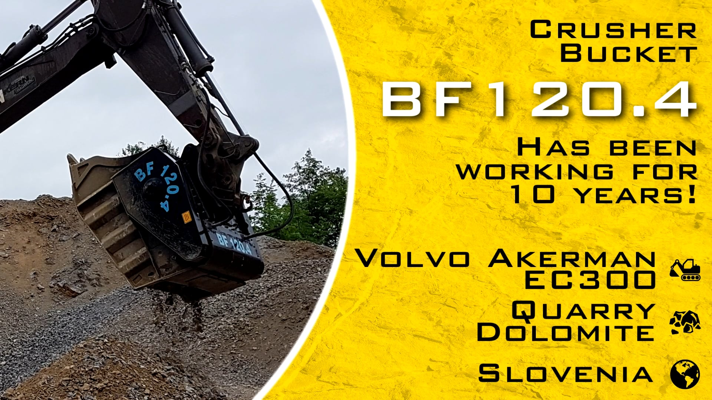

# MB製のバケットクラッシャーは新製品を投入しながら優れた販売実績を誇っています。 ここでは日常ご使用頂いているお客様の声を聞いてみましょう。
製品の開発に鎬が削られる世界では市場に新モデルが投入されるや否や現行モデルは生産終了となるケースが多々ありますが耐久性、革新性、コスト面にでいくつかの例外があります。　

“弊社のセールスマン達が十年近くMB製品を使い続けて頂いているお客様の話をしてくれる時 – MB社生産総責任者アッゾリン ディエゴ氏の言葉 – 最高の賛辞を送ります、なぜならお客様が末永く弊社の製品をご愛用頂いており、なお且つお客様の利益にも繋がっているからです。”

## 幾つかの建設現場での証言: MB製品を使用頂いている3社のケースを見てみましょう。

ドロミーティ山脈周辺の岩を破砕するポルホフ グラデック社のケースの様にMB製のバケットクラッシャー単体で全てのプロジェクトを行おうとすると作業は容易ではありません。

最初のケースはスロヴェニア、リュブリャナから30キロのところにある採石場にて10年以上順調に稼働しているBF120.4に付いてです。: スロヴェニアの会社の代表は重要なのは専門の技術者、代理店に問い合わせすることなく現場作業員が定期的にベルト交換のメンテナンスを行うだけで今まで何ら障害なく事業を行ってきています、と笑みを浮かべながら語っています。

一方、ドイツ、ミュンヘンの解体会社のケースですが2011年にMB製のバケットクラッシャーBF70.2をご購入頂き更に翌年2012年にもMB-S14 スクリーニングバケットと2種類の寸法が異なる網目を一緒にご購入頂きました。 1つは土木処理用、もう1つはコンガラ用です。　結果が良好だったので同社は2017年に最新型バケットクラッシャーBF70.2 S4 の購入に踏み切りデモやコンクリート、コンガラ等のリサイクル事業を拡大しています。

“3代続いているMB製バケットクラッシャーは共に役目を完璧にこなしています。  MB製品は新たな雇用と収益を創出しています、とミュンヘン会社の代表は語っています。　”

3ケース目はヴェローナに本社があるジェネラル スカーヴィ社です。

事の経緯は2007年にMB社のバケットクラッシャーBF90.3を購入し作業が簡略された時から始まります。 　 2009年に新車のホイールショベルを導入した際にMBのバケットクラッシャーBF70.2を選択し “このバケットクラッシャーは今でも変わらない生産性をあげています、とジェネラル スカーヴィ社の代表はお話しています。

7年間バケットクラッシャーを使い続けていますがコンガラにも対応出来、未だに問題無く稼働しています。”

最初の特許取得済みのMB製のバケットクラッシャーから既に建築現場に革命をもたらしました。 それ以来、作業領域と ”トランジット” は高いパフォーマンスと収益性を上げています。　この変化のメリットは？　全て機械のおかげです。 : MBクラッシャーは作業の負担軽減、供給の拡大、作業時間の短縮等、作業現場の為に設計されているのです。

どのタイミングで新機種が投入されるのでしょうか？
MB社の生産総責任者は自信ありげに語ります : “我々の製品に対する目標は如何に生産能力を向上させ、またお客様に長くご愛用される製品を作り上げるかなのです。 我々の製品、付属品は継続的に改良されてきておりますが当然、これで満足はしておりません。　新製品は現行型を改良しているものでお客様、市場の要望に沿う様に対応していく事なのです。”

全てのMB製品は材質、装備、信頼性と耐久性の向上等、　即戦力で稼働可能な様に設計されております。

“弊社製品がお客様と共に成長出来た事は我々のよろこびです – 語っているのは再びディエゴ アッゾリン氏 -　先の市場を先読みし競争力を高める為に設計されているだけでなくサービス面でも世界中何時でも何処でも24時間、信頼出来るサポートで繋がっているからです”

キャプション

スロヴェニア、　リュブリャナではMBバケットクラッシャーBF120.4 が10年以上、問題が生じる事なく稼働し続けています。

“3代続いているMB製バケットクラッシャーは共に役目を完璧にこなしています。  MB製品は新たな雇用と収益を創出しています、とミュンヘン会社の代表は語っています。　”

7年間バケットクラッシャーを使い続けていますがコンガラにも対応出来、未だに問題無く稼働しています。