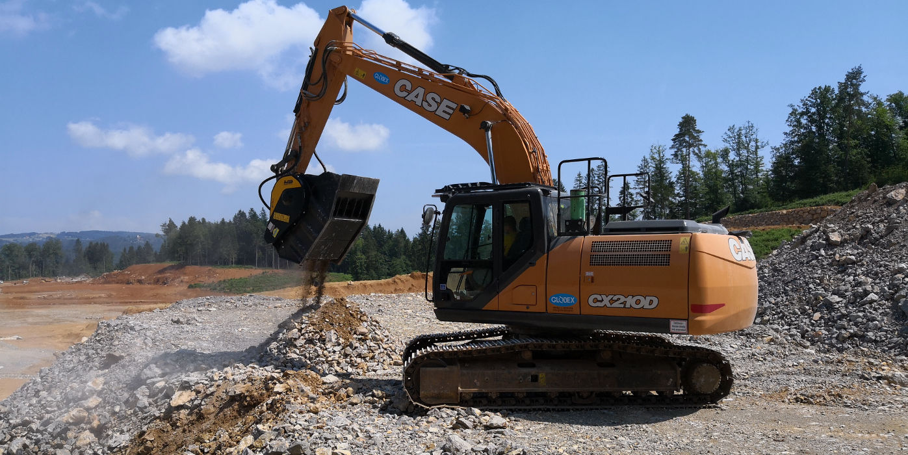
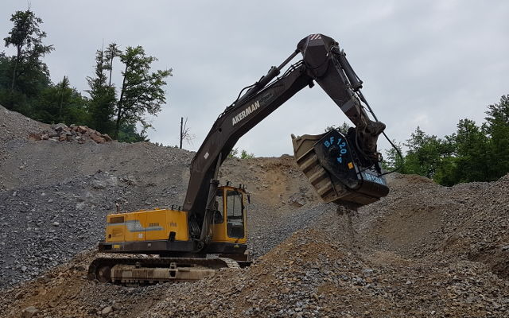
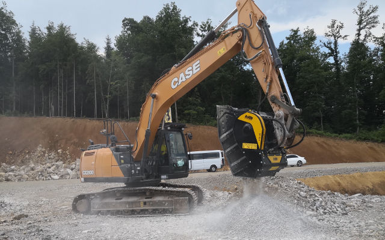

# 15年以上にわたり業界のトップを走り続けてきたMBクラッシャーが耳を傾けた 世界各国で活躍する現場の人々の声をお届けします： ノンストップ体制に焦点を当てた働き方。これこそが厳しい競争を勝ち抜くためのカギです。
「余計な物流コストを省き、作業は正確かつ迅速に行うことが必須。簡単メンテナンス大歓迎。新たに覚えなくてはならないような最新技術はお断り。」

この率直かつ単刀直入な意見は、建設業・解体業・道路工事業・土木業・工場や施設の修築・パイプ工事・掘削やトンネル工事・土壌改良に携わる世界中の業界関係者、そして現場で働く人々の共通の思いです。

「我々の業界では継続的な作業が必要とされます。エンジンを切るわけにはいかないのです。止めてしまったら、どうやってこの業界で勝ち進むことができるでしょうか。」この発言には、建設現場や工事現場、掘削作業あるいはリサイクル業などの現場の事情を知っている人なら読み取ることのできる、仕事に対する、また発注者および工期に対する強い責任感が強く感じられます。

MB クラッシャーが15年以上前から掲げているミッションは、正にこの通りです。現場作業に推進力を与え、作業の質を高め、競争力を付けることで、疲れを知らない勝者であり続けること。「疲れを知らない」という表現に相応しいのは、十年以上も休まず続けて使用できる特許取得済MBバケットクラッシャーです。それもそのはず、なぜなら簡単なグリスアップをするだけで駆動部を良好な状態に保持することが可能だからです。現場内での完全処理、そして費用ゼロ。これはMBのモットーです。どのような骨材でも現場内で破砕できるため、発生材の廃棄処分も運搬費やレンタル費用も不要です。MBバケットクラッシャーは、最も効率の良い作業が要求される現場にとって理想的なアタッチメントです。専門技術者の派遣はもちろん、交換部品購入も最小限に抑えられるよう設計されているため、メンテナンスにかかる費用はほぼゼロに等しいと言えます。

グイド・アッゾリンはこのように話します。「営業本部長として自信を持って言えますが、私達は世界各地の事業者の方、あるいは油圧ショベルを運転する方のように様々な現場に携わる方々からお問い合わせやご相談を毎日受けています。多くの場合、年季の入ったものをそのまま継続してご使用頂く場合のコストと新規導入した場合のコストを、ご相談者様と一緒に分析します。そして、現場の地域性や制約、使用目的などお客様の現場の諸条件を考慮し、最大の処理能力および収益性を引き出せる最も適切なアタッチメントをご提案させていただいています。バケットクラッシャーとスクリーンバケット において、MBが最も幅広いレンジを誇るのには訳があります。『古い』型式のMB製品は、新しい製品が導入されたからといって、寿命だからと処分されるわけではありません。なぜなら年式がいくら古くても、特許取得済みということは、研究に研究を重ねて開発され、性能も実証済み、不動の人気製品ということだからです。研究によって可能とされることに関しては全て改良を続けています。しかしながら、現場内での破砕作業、操作とアップデートの簡易性、タフな構造による高い耐久性、競争力のあるコストに関しては改良の必要がありません。業界のトップに君臨し続けることができているのは、この揺るぎない強みのおかげです。今回はMB製品をご使用のお客様の貴重な声をご紹介させていただきたいと思います。YouTubeでは、14年もの間ずっと働き続けるMBバケットクラッシャーが効率的に破砕している様子をご覧いただけます。また、導入されると間もなく生産サイクルに組み込まれる新製品が誇る抜群の処理能力もお見せします。」

ノンストップ体制に最大収益性。これは、油圧ショベルを改造せずに処理能力をアップさせたい全てのお客様へのMBからの約束です。グリスアップ、破砕刃の交換、あるいは新しいバケットの取付け。どれも容易でシンプルな作業のため、新たに設定し直す必要もなれければ、特別な講習や研修を受ける必要もないので、時間の無駄もありません。導入すると同時に作業に取り掛かれるため、真の破砕機として即時に収益を上げることができます。

世界中のお客様のサポートに努めます。MBは、世界の各地に散らばるエージェントと販売代理店を通じ、現場がどこであれ、お客様に迅速で細やかなサービスを提供しています。情報や製品をタイムリーにお届けし、実演デモや技術サービスに対するご要望にもスピーディに対応し、休日、夜間にかかわらず徹底してサポートに尽くしています。お電話１本、あるいはウェブサイトからのお問い合わせ、またはチャットによるご相談をいただければ、ご訪問のアポイントメントや資料請求にも即時応じております。また、実際に動かしてみて世界一と評価されるMB製品の効率性を自分の腕で確認したいとご希望されるお客様のご相談にも応じています。

コストを「砕き」、現場内で利益を生み出す。これは、MBの根本的理念であり、また、五つの大陸に散らばる現場の人々が強い共感を覚えるコンセプトです。

データに見るMBクラッシャー

- 破砕、解体、リサイクルの業界においては国際的に高い評価を受け、15年以上にわたる実績を認められているMB。
- 2001年、MBは世界に先駆けバケットクラッシャーで特許を取得。それにより、高い生産性を誇りつつ作業のシンプル化を図り、作業現場の根本的変革に成功。
- バケットクラッシャー販売数、2万台。油圧ショベルやホイールローダなど、様々な重機に取り付けるだけで、正真正銘の破砕機にチェンジ。その幅広いサイズ展開により、多種多様な現場で活躍
- 生産拠点および本部を置くイタリア本社の敷地は17,000㎡。海外支店７店。世界各地に広がる物流倉庫
- アフターサービスを含むカスタマーサポートは年中無休24時間体制でお客様をサポート