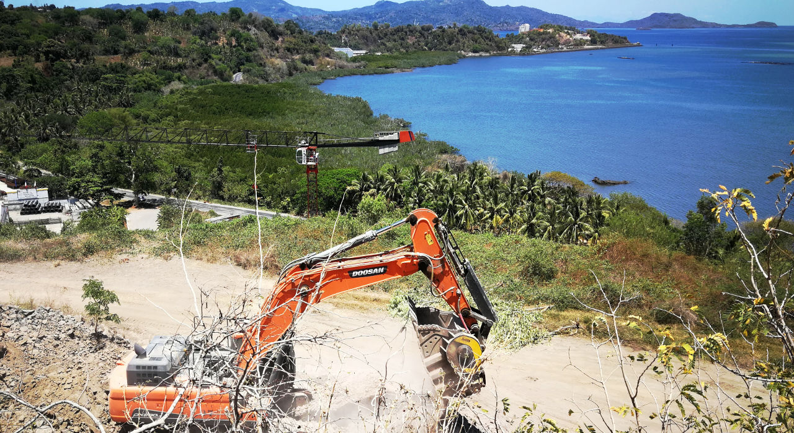
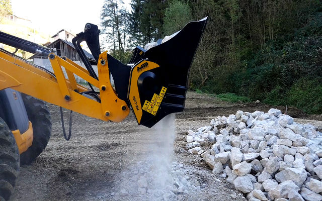
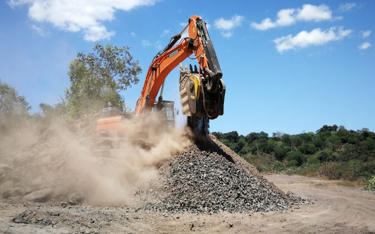
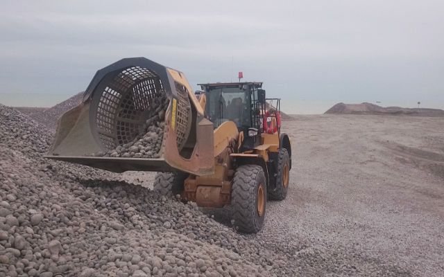
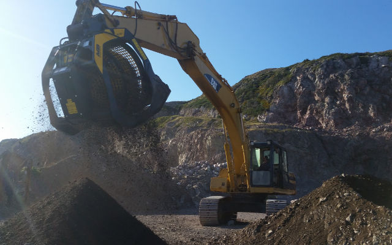

# 大きいサイズから小さいサイズまで、各サイズを揃えるMBクラッシャーだからこそできる離島での工事。孤立し、工事車両が出入りしにくい土地、離島が抱える数々の難関をMBが突破。

大きいサイズから小さいサイズまで、各サイズを揃えるMBクラッシャーだからこそできる離島での工事。孤立し、工事車両が出入りしにくい土地、離島が抱える数々の難関をMBが突破。
MBクラッシャーが数年前から真剣に取り組んでいることがあります。それは、MB製品をご使用のクライアントの体験談を別のクライアントにも共有していただきヒントを得てもらうことです。そのために、まずクライアントからご提供いただいた作業中の映像や画像を披露します。そこで、現場の生の声を届け、実際に使っている様子をご覧いただきます。動画や画像等を通じた体験談は、単独ではなかなか思いつかないアタッチメントの潜在能力を活かすアイデアが満載です。

「興味深いことに、クライアントは同業者のやり方を見て有益なヒントを得ることが多いのです。」と説明するのはMBクラッシャーの生産部部長のディエゴ・アッゾリン。「自身の現場や使用場面とは一見かけ離れたような状況・条件下でアタッチメントが使われているのを見て、その生産力を再認識した時、収益力に直に結びつく新しいアイデアが生まれることがよくあります。やはり求めているものは皆同じなのです。情報の交換・共有は賢い選択の手助けをしてくれます。賢明な選択をすることが現場の生産性・収益性の向上への第一歩になるのです。私共の製品の使用に関して「目から鱗」的なアイデアを提供してくれるのが実はクライアントだったということも稀ではありません。さらに広範囲に適用できる場面を示唆してもらえるのは大変ありがたいことです。」

「不可能」を「可能」にするヒントを与えてくれた貴重な事例はいくつかありますが、まずは、クロアチアのラブ島から。ここでの最大の問題点は、砕石調達コストが高過ぎること。こちらではヴィッラ建設基礎工事のための掘削作業が行われており、工事現場に土工車両が出入りするための道を整備するには、砕石を充填しなければなりません。しかし、その肝心の砕石は値段が高過ぎて手が出ない…。そこで閃いたのは、まさに掘削作業をしている最中のこと。MBバケットクラッシャーを導入して、掘削作業で発生した石をその場で破砕し現場内で再利用する。現場で作業している土工機械のうちの１台、JBCのバックホーローダ4CXに取り付けられたのはMBバケットクラッシャーシリーズの中でもコンパクトタイプ。成果はどんぴしゃり。使用するのは土工機械１台のみで、補佐を一切必要とすることなく現場内で直接破砕作業が行えるため、資材調達のコストのみならず、廃材運搬費や処理費のカットも成功。ここで活躍したのはMB-L200。MBバケットクラッシャーの中でも小型タイプのため価格もお手頃、使い勝手も抜群です。MB-L200は6トン以上のミニホイールローダから、7トンから最大10トンまでのバックホーローダとホイールローダに対応しています。

２つ目の事例は、インド洋に浮かぶコモロ諸島に属するマヨット島から。ここでの最大の難関は言うまでもなく島に入るのが困難なこと。それだけでなく、道路建設のための路盤には、玄武岩質の採石場で残ったものが使用されるのですが、その肝心の採石場に入ることがまた困難。このような場面では大規模な機械は役立たず。

重さ、サイズともに不利だからです。ここでの打開案は、強力なパワーを持ちながらも使いやすいMBのバケットクラッシャーBF135.8を採石場に導入すること。バケットクラッシャーのシリーズの中でも大きいサイズに入るBF135.8ですが、無駄のないコンパクトな構造設計により、使う人には優しい仕様となっています。もちろんメンテナンスにも移動させるのにも特殊機械を必要としません。１時間あたり88㎥の処理能力を誇り、積載可能量は約1､3㎥。現場の責任者によって撮影されたその活躍の様子を動画でご覧いただけます。

さて、「不可能」を「可能」に変える旅はまだまだ続きます。次は、フランスのカイユー・シュル・メール。こちらイギリス海峡側海岸で採れるシリカの小石は、世界で最も純粋なこと（純シリカ99％）で有名です。ここで要求されるのは資材運搬費のカット。海岸で採られる石をその場で選別、分級、梱包、そして搬送する。なかなかにハイテンポで画期的なこの大仕事に取り掛かったのは、たった一台のアタッチメント、MBスクリーンバケットです。小石をすくい入れ、砂をふるい落として分別、そして、サイズ別に分級する。この全ての作業を海岸にいながらこなしてしまうのです。MBクラッシャーのスクリーンバケットは各型式とも、採石場や工事現場等で天然素材を選別できるよう設計されています。網目サイズが充実しているので、バケットのスクリーンを付け替えることで希望の大きさの資材を得ることができます。こちらカイユー・シュル・メールにての活躍する、キャタピラーのホイールローダ962Mに装着されたMB-LS220が動画でもご覧いただけます。 建機とアタッチメントの最適の組み合わせです。申し分のないサイズとパワーを併せ持つスクリーンバケットで一次選別を行うことにより、導入以降、破砕作業にかかる時間の最大60％削減に成功しました。

カイユー・シュル・メール - スクリーンバケットMB-LS220

<iframe width="360" height="203" src="https://www.youtube.com/embed/E1RJgMTarnI" frameborder="0" allow="accelerometer; autoplay; clipboard-write; encrypted-media; gyroscope; picture-in-picture" allowfullscreen></iframe>

カイユー・シュル・メール - スクリーンバケットMB-LS220

そして、大西洋はカナダのセントローレンス湾に浮かぶ起伏の多い二つの島、サンピエール島およびミクロン島にやってきました。道路網の整備に伴い、山間部に通路を確保するために広範囲に渡って岩場を取り壊す必要がありました。ここで障壁となったのは、作業するスペースが限られていたこと。また、運搬費と発生土の処理及び新材調達にかかるコストの高さもネックとなっていました。こちらのクライアントは、掘削作業で発生し集積されている花崗岩石をその場で分別するやり方を選択。以前MBのスクリーンバケットが作業している様子を直に見て、その処理能力の高さを目にしていたのです。スクリーンバケットで湿った土をふるい落とし、岩石は路盤に直接再利用します。今回大活躍したのは、MBのスクリーンバケットMB-S18。多量の資材のふるい分けを目的に設計されており、大規模な現場や大量の生産が見込まれている場面では極めて高い処理能力を誇ります。ここではキャタピラーの油圧ショベル330に取り付けられ、網目サイズ50のスクリーンで作業している様子が動画でご覧になれます。多量の材料を即時にふるい分け、有効利用できる資材に変換することで作業時間とコストの大幅な削減に成功した一例です。

自社製品が世界中で使われているのを確認できることはMBクラッシャーの特権だと感じています。」最後にディエゴ・アッゾリンはこのようにまとめます。「なぜなら、道路・土木・採石・鉱山・建設・整地・リサイクル・土壌改良等のあらゆる工事に関する問題点や改善点、生産力とコスト、制約あるいは革新的なアイデアなどを一元化した『観察記録所』を所有しているのに等しいからです。バケットクラッシャーとスクリーンバケットといった、画期的な製品により私たちは国際的に認められています。使いやすく操作しやすい製品の特徴こそが、場所や現場や場面を選ばない製品の汎用性を表し、そのおかげでどこでも『コスト』を『利益』に、『問題点』を『チャンス』に変換することができるのです。離島での作業のように厳しい条件下の現場や土地でも、MBクラッシャーのアタッチメントを使用することにより、サイズの大小に関わらず、最大のメリットと収益力を得ることが可能だと今回も証明してくれました。また、最適なアタッチメントとして当社製品を選んでいただけるのは大変光栄なことです。正真正銘のビジネスパートナーだとクライアントから認められたことになりますからね。私たちの経験とアイデアを共有してもらいたいという思いによって業界内で役に立てれば本望です。狭い範囲に限らず世界中のどこででも、ね。」