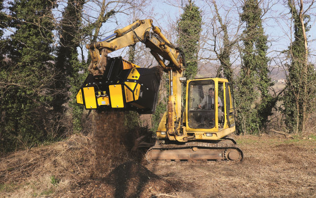
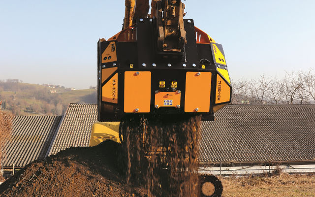

# 世界初の二枚刃動作で特許を取得したバケットクラッシャーの生みの親MBから、画期的なシリーズMB-HDSが誕生。現場で働く人々の手助けとなる正真正銘の現場改革です。
世界初の二枚刃動作で特許を取得したバケットクラッシャーの生みの親MBから、画期的なシリーズMB-HDSが誕生。現場で働く人々の手助けとなる正真正銘の現場改革です。
「今回新しく開発したアタッチメントには、私どもの持つもの全てを注ぎ込みました。先進技術を結集し創意工夫を凝らし、試作に試作を重ね、最良のものに仕上げるのに何年もの時間を費やし努力を傾注してきました。まさに私どもの血と汗の結晶です。このたび、工事を受注する企業や現場で働く人々のお役に立てる画期的な製品をご紹介できることを大変嬉しく思います。」

MBクラッシャーの生産部部長ディエゴ・アッゾリンは、新世代ロータリースクリーニングバケットの発表にあたり、このように語ります。この新製品が世界デビューを果たしたのは、ドイツのミュンヘンにて開催された、世界最大建機展の一つであるbauma 2019 (国際建設機械見本市)です。

「新シリーズMB-HDSは、現在市場に出回っているものとは根本的に異なります。真の万能機として生み出されたこのアタッチメントは多種多様な現場で使用でき、簡単にしかも驚くほどスピーディーに様々な素材を処理できます。専門技術者の助けを必要とすることもなく、特別な技術講習を受ける必要もありません。現場作業を簡易化し、現場内で完全処理を行うことにより、競争力を付けて利益を生み出す。これはMBが掲げているミッションです。初代バケットクラッシャーが2001年に世界で初めて特許を取得して以来、MBクラッシャーはこのミッションに忠実に進化を続けてきました。現場のプロや工事を受注する企業、そして実際に作業を行うオペレーターが求めているのは、メンテナンスなどによる稼働ロス・休止損失を避け、連続作業をスムーズに進めること。それと同時に、コストが高くつく廃材の管理および処理を簡易化することです。企業や現場にとってそれぞれの将来を左右するこれらの重要な課題に対し、廃材を収益に変換させる革新的なアタッチメントを次々と提案し、MBは常に全力で課題解決に取り組んできました。そして、今回、新作ロータリースクリーニングバケットMB-HDSをラインアップに加え、さらに前進しました。MBの「研究開発部」は見せかけの名称ではありません。世界各地の現場にて15年以上も休むことなく働き続けるMBのバケットクラッシャーやスクリーンバケットと同様、ここ研究開発部も常にアクセル全開です。」

無駄を減らし、現場の生産性を向上させる。最新作もまた、このMBクラッシャーの建設的哲学に基づき設計・製造されています。五大陸において高く評価され続けているイタリアの企業MBクラッシャーの珠玉の逸品、新ロータリースクリーニングバケットMB-HDS。その本質は、様々な素材を処理対象物とし、多様な作業に対応して作業そのものを簡易化する柔軟性・汎用性です。材質の異なる各種廃材を管理・処理する必要がある現場において、それら各材をその場で素早く処理し再利用可能な再生材に変換するこのアタッチメントは、まさに現場の「切り札」となります。

「今回開発したのは、土木、掘削、解体、リサイクル、農地改良、土壌改良、緑地保全等の工事・作業に携わっている人々の日常的な悩みをたった１台で解決するアタッチメントです。新シリーズMB-HDSは、多種多様な素材を分別、破砕、そして再生材に変換することができます。掘削材、解体工事で発生する廃材、アスファルト、石炭、有機材、木材、樹皮、軽プラスチックなど、ありとあらゆる素材を処理します。例えば、今処理し終わったものとは異なるものを今すぐこの場で処理したいというニーズがあります。

例えば、今処理し終わったものとは異なるものを今すぐこの場で処理したいというニーズがあります。MB-HDSを使えば全く問題ありません。ここで新技術の本領発揮です。ロータリースクリーニングバケットMB-HDSは、作業現場でロータリーシャフトを容易かつ安全に交換することができるのです。一人で交換できる上、所要時間はたったの数分です。特許取得システムにより回転式のブラケットはブロックされるため、ロータリーシャフトは簡単に取り外せます。そして、任意のロータリーシャフトを取り付けるとすでに位置合わせは終了しています。このシステムの実現は、私どもMBにとって一つの目的を達成したことを意味します。交換作業の簡易化は、工事を行う企業にとって、その企業規模にかかわらず現場での作業が常に進んでいること、つまり稼働ロス・休止損失の回避を意味します。質の良い再生材を生産することで、リサイクルあるいは資材販売が可能となるだけでなく、運搬や廃棄処理のコスト、そしてメンテナンスにかかるコストの削減が可能です。

従来では交換作業が困難なことがネックとなっていました。特に、ロータリーシャフトを正確にセットするのがかなり難しく(駆動システムおよび横に並ぶロータリーシャフトと正確に連動させる必要があるため)、また、ベアリングの交換も大変でした。

新型ロータリースクリーニングバケットMB-HDSは、多様な素材の分別や破砕、攪拌等の処理に対応できるよう4種の機種が揃っています。他のMBアタッチメントと同様、油圧ショベル・ホイールローダ・ミニホイールローダ・ハックホーローダ等の５トン〜35トンの土工機械に対応しており、取り付けも簡単です。そのため現場を選びません。広範にわたる工事現場から市街地での工事現場まで、あるいは大規模なパイプ工事やほど遠い農地での作業など、どのような場所でもその場に適した建機に取り付けて使用できます。また、ロータリーシャフトの交換はどこでも行えるようになっています。グリスポイントは一箇所にまとめられ、メンテナンスに必要な工具はアタッチメントに装備された工具入れスペースに収まっています。創意工夫が見られるのはそれだけではありません。新シリーズMB-HDSは、建機にも優しい設計になっています。

自動システムのオイルショックアブソーバー搭載により、モーター、駆動部および建機に負担がかからないように作られています。これら全てアタッチメントと建機の長寿命化、そしてメンテナンスにかかるコストの大幅な削減につながります。

「ロータリースクリーニングバケットMB-HDSは、コンパクトかつタフな構造で耐久性に優れていますので、安心して使用できます。」アッゾリンは続けます。「様々な場面で多岐にわたる用途に柔軟に対応できるよう精巧に設計されているため、作業時に発生する音も抑えられています。そのため、時間やスペースが限られている上に、処理対象物が何種類もあるような市街地や住宅街での作業の際も、周囲の生活環境に配慮して行うことができます。騒音・振動に関する規定にも対応し、自動化制御盤システムの導入により作業時のフレームの共振が40％低減されていますので、防音保護具の着用なしでも使用できます。」

バケットクラッシャーにおいては世界シェア90％を超えるMBクラッシャーが、確証された技術による信頼性と廃材を収益に変換する方法をお客様にお約束いたします。そして、世界中のどこからのお問い合わせにも24時間体制で対応するカスタマーサービスにてお客様を全面的にサポートいたします。

「新世代ロータリースクリーニングバケットMB-HDSは、来たる2020年、そしてその先のために、MBクラッシャーが現場で働く全ての人に贈るエールです。『困難を打ち砕き、それを競争力に変換する！』」（生産部部長のディエゴ・アッゾリン）