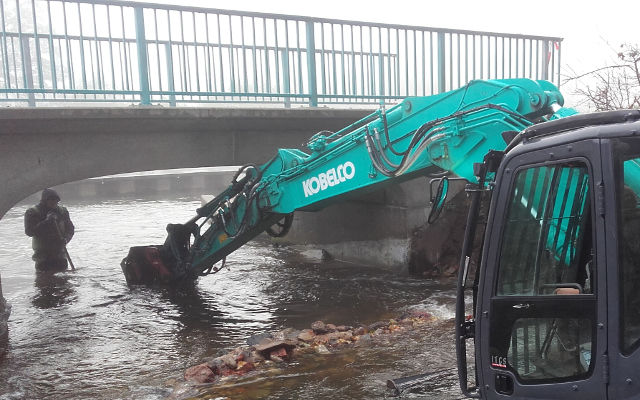
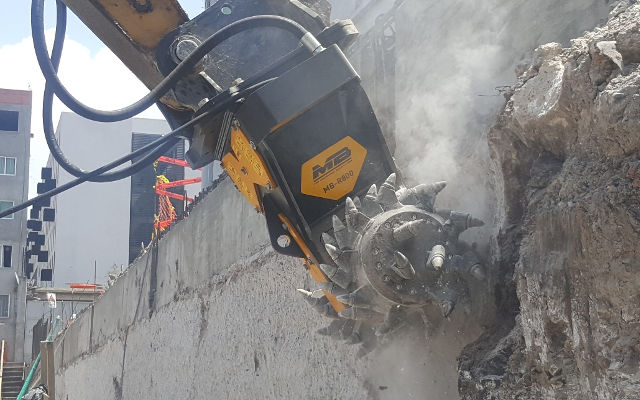
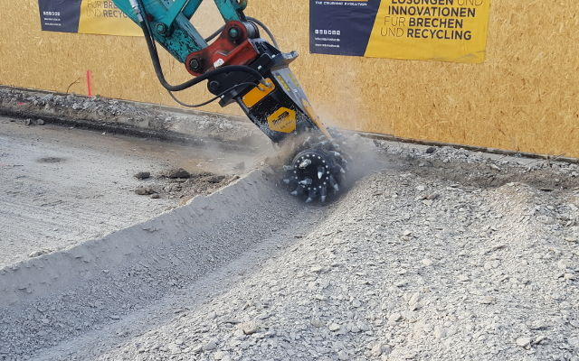

# 掘削・解体・切削工事を「ミリ単位」の精度で安心サポート

硬い材料を「ミリ単位」で削り取る掘削・切削作業には欠かせない切削機ですが、実はその中でも特に有能なものがあるのです。歴史的建築物の解体工事あるいは橋梁上の切削工事など、住宅やビルが立ち並ぶ街中での作業は、周囲の環境にも配慮しつつ限られたスペース内で行われなければならず、様々な問題点が内在します。ブレーカーからは不快な騒音や振動が発生しますし、切削範囲のわずか１センチの違いが工事単価および収益に影響します。

「精度、そして好機を活かすこと。私たちの仕事で重要なのはこの二つ。」現場のプロはこのように語ります。「私たちに課される工期、場所や規定、あるいは機械に関わる制約に関しては認識されていないことが往々にしてあります。」

精度の高い切削機が求められると同時に注意を要する現場といえば、建物の解体工事現場があります。緑地づくりや住宅建設のため、住宅密集地にて土台や基礎などの礎石の切削が行われます。また、アスファルトやコンクリートが切削対象となる道路・橋の路面切削工事や平坦性を回復させる補修工事、あるいはインフラ整備のため都市地域の狭い場所での開削作業でも高精度の切削機が必要となります。農業や別の分野にも目を向けてみると、採石場や採掘における壁面の切削作業ではもちろんのこと、農地を耕す、除礫、灌漑施設の設置、川底の整地、木材の切削、トンネル掘削など、水中での使用も含め、多様な場面で精度の高い切削機の使用が必要不可欠となっています。

ル掘削など、水中での使用も含め、多様な場面で精度の高い切削機の使用が必要不可欠となっています。
そんな現場で使用される建機アタッチメントの常識を覆したのが、MBクラッシャーです。20年にわたり研究と開発を重ね、バケットクラッシャーとスクリーンバケットを次々と生み出してきたイタリア企業。そのMBクラッシャーが油圧式切削機という新しいコンセプトを創り出しました。「現場作業の効率化をサポートするアタッチメントの開発と改良への強いこだわり。これはもう血筋でしょうね。」と説明するのは生産部部長ディエゴ・アッゾリン。「このこだわりは、私たちのミッションであり、仕事に対する姿勢そのものです。現場で働く人々にとって最も有益なソリューションを見つけるまでは製品化することはありません。特許取得済みMBアタッチメントに加え、ここ数年はドラム式切削機の開発に全力を注ぎ込んできました。そして、誕生したのが画期的ツインヘッダーです。MBツインヘッダーは世界で唯一、左右独立した減速機（Direct Drive Twin Motor System）を搭載しています。この特許取得済みシステムにより左右のドラムの駆動力は独立して制御されます。接触する対象物の硬度や靭性に応じ、左右の切削ドラムが独立して駆動制御されるのですから、ものすごいメリットです。」

処理対象物に応じて選択可能なビットとドラムのセットもご用意しています。また、次世代シリーズではパワーブースト（Power Boost）を標準装備。より大きなパワーを必要とする切削ヘッダーの力を増倍させ、抜群の成果を発揮します。

「従来の油圧式切削機では、ねじりと振動による油圧ショベルのアームへの負担が大きいのが難点です。」とは現場の声。「油圧ショベルにかかる負担が大きいということは、激しい摩耗によりコストが跳ね上がることを意味します。それ以前に、市街地での工事や人の多い場所で作業するには、騒音や粉じんに関する規定や条件があるので周囲環境に十分配慮する必要があります。」

MBは、油圧ショベルへの負担低減のため、ねじれ防止システム（No Torsion System）を採用しています。油圧ショベルのアームにかかるねじれが自動制御により低減。精度アップと同時に、メンテナンスにかかる時間とコストの削減を実現。油圧ショベルにも優しい設計となっています。

市街地での工事現場のニーズに対応し、散水装置やドラムカバーもオプションで装着可能です。粉じんを抑えてくれるため、閉鎖した空間での作業環境が向上。また、中心街や住宅街のように振動に対する作業条件が制限されている現場でも使用することができます。

「今回新たに導入された革新的技術がもう一つあります。」と説明を続けるアッゾリン。「それは、常に時間との戦いの中で奮闘する現場への助け舟。切削ドラムの交換は現場にいながら１時間もかけず容易に行えるよう設計されていること。これは今までは考えられないことでした。従来は整備工場にツインヘッダーを持ち込んでいる間、ベースマシンが停止し非稼動ロスが生じてしまっていたのです。ところが、MBツインヘッダーなら小一時間で切削ドラムが交換できるので、現場の生産性が大幅に向上し、競争力もアップします。」

アタッチメントの本体中心部を保護するために耐摩耗プレートを装備。高い処理能力を保持しつつもベースマシンのオイル温度の上昇を抑制し、アタッチメントとベースマシンを同時に守るオイル温度制御装置も追加可能です。

ツインヘッダー MB-R700 - Kobelco

ツインヘッダーMB-R800 - Caterpillar

ツインヘッダー MB-R900 - New Holland

「操作性に優れ、使い方も簡単なアタッチメントだからこそ」アッゾリンは最後にこうまとめます。「精度の高さ、安定した切削深さ、廃材の削減、規定の遵守、これらの要素が全て日常的に求められる現場において、次世代MBツインヘッダーはその収益力を上げる大きなサポートとなります。１センチの違いが生産的・経済的価値に影響を与える現場で巨大な『メス』のごとく極めて正確に確実に削り取ります。」

また、道路工事やトンネル工事での作業の効率化にはオプショナル製品、回転ヘッドが最適です。キャビンから切削ドラムの角度を自在に変えることができるため、マシンを停止する必要がありません。時間ロスを削減し効率化をサポートする優秀なツールです。また、切削深さガイドを使用すれば、削り取る深さを正確に調整することが可能です。過不足なく必要なだけ切削することで、切削廃材の処理にかかるコストを大幅に削減できます。

次世代MBツインヘッダーシリーズは油圧ショベル、ホイールローダ、およびバックホーローダに対応。極めて高い精度、パワフルな性能、柔軟性といった特徴を備え持ち、現場の様々なニーズに応えます。作業上の制約を最小限に抑え、非稼動ロスをカットし、廃材処理・メンテナンス・摩耗にかかるコストを削減します。これぞ正に痒い所に手が届く有能アタッチメント。掘削工事、解体工事、切削工事、あるいは地下鉄工事における、今までにないソリューションの登場です。