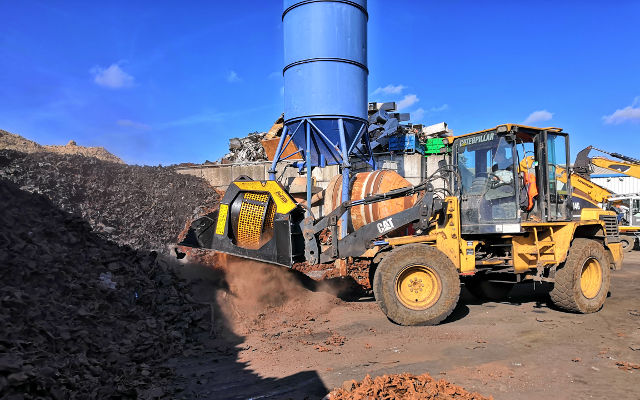

## 現場のプロを対象とした無料サービス「MBの現場お悩み相談室」開設

困った。どうしよう。どうすれば…。

そんな現場のお悩み相談をMBがお受けします。一風変わったご相談も大歓迎。

「MBの現場お悩み相談室」は、MBが長年培った経験とノウハウを惜しみなく現場に提供する新サービスです。ややこしい仕事、あるいは特殊なものの処理。どんな機械を使って処理すればいいのかわからない。このような現場の複雑なお悩みを伺ってMBが解決策を提案します。

どんなサービスかって？説明をするのは、兄妹一丸となってMBクラッシャーの改革魂の中枢をなす、生産部部長ディエゴ・アッゾリン。

「このサービスは、建設、解体、掘削、土木、整地、水道管やガス道管の敷設工事、採石、土壌整備など、あらゆる分野で活躍されている現場の方々を対象としています。サービスの内容ですか？MBが現場からのご相談をお受けし、技術エキスパートの経験とノウハウでもって対応させていただくというものです。当社ではお客様からのお問い合わせやご相談に対して迅速かつ丁寧に対応するサポート体制がすでに整っています。お客様のニーズを把握した上で、それそれの現場に最適なアタッチメントの選択のお手伝いをさせていただき、アタッチメント使用による労力・コスト削減をご理解いただいております。この度、一見突飛なように思われる業界のニーズや思いも寄らない現場からのご要望にも迅速にお応えできるよう、エキスパートを増員しサービスのさらなる充実を図りました。」

MBクラッシャーは長年にわたり、多様な現場のそれぞれ異なる悩みに耳を傾け、具体的な解決策を提供してきました。その経験を通じ、自社製品が一般的に考えられる分野とは一見異質とも言えるような分野や用途においても実効性のあるソリューションとなりうることを確信しました。

今回はこのようなちょっと特殊な事例をいくつかご紹介します。

まず始めは、農業界および金属加工業に携わるドイツ企業Kübler社。解体現場で発生する大量の廃材や、墓石に使用された花崗岩の残り材が現場内に置かれていました。再生活用されることなく場所を取るだけのこれらの廃材の山。

そこで、Kübler社はバケットクラッシャーMB-L160を使って、これらの廃材を処理することにしたのです。実行してみると、まさに一石二鳥。現場内で破砕処理し再生砕石を生産できるので、第三者に再生砕石を買い取ってもらうことで利益が倍増、さらには同業界の中で差別化を図ることが可能になったのです。

次の事例はアメリカ合衆国の一企業。こちらでは放射性物質の柱を撤去し廃棄する必要が生じていました。そこで、キャタピラー油圧ショベル２台を使用し、バケットクラッシャーBF90.3を１台ずつ取り付けて使用。現場内で破砕処理することにより、安全かつ低騒音の作業が可能に。作業中に発生する粉塵を抑えることが最優先されましたが、MB製散水装置を取り付けて難なく実現を図りました。

別の成功事例はボーリング作業中に発生する危険性物質を取り扱う南アメリカの企業です。油の混ざった掘削屑を固体と液体に分離しようと選んだのは、スクリーンバケットMB-S18。会社が保有するキャタピラー油圧ショベルにMBスクリーンバケットを取り付けて使用。液体成分を分離させたのち再利用することにより掘削泥水を新たに生産することが可能となりました。現場にとっては収益アップでメリット大。

一方、フランスではスクリーンバケットMB-LS170 が少し特殊な用途で利用されています。焼却炉の灰に混ざっている鉄クズを分離して取り出すのです。分別された鉄は自動車製造分野でリサイクルされます。MBスクリーンバケットは油圧ショベルに直接取り付けて使用されるので、その他の車両等を必要としません。そのため油圧ショベルに使用する以外の燃料は不要となり、環境保全の面でも地球に優しい設計となっています。

所変わって、ここはメキシコ、石膏の採石場です。爆薬による爆破破砕はコストがかかるだけでなく正確性もあまり高くありません。そこで、選ばれたのがMBツインヘッダー。ミリ単位で正確に削り取り、大量の粉塵を発生させることなく粉砕して石材を生産することに成功しました。

最後にMBの本拠、イタリアはトレンティーノ・アルト・アディジェ。2018年末暴風により広範にわたって森の木という木がなぎ倒されてしまった地域です。倒れた木々を掴み取り移動させて整備するために、こちらの会社ではグラップルMB-G900を油圧ショベルHyundai 210に取り付けて使用。動きが素早く高い正確性を誇るMBグラップルは柔軟に軽々と作業をこなし、チョイスが間違っていなかったことを証明しました。

グラップル MB-G900 - New Holland MH36

スクリーンバケット MB-LS170 - Caterpillar

ツインヘッダー MB-R800 - Caterpillar 320

これらの事例はほんの数例です。MBアタッチメントを使ってちょっと特殊な仕事を処理したお客様の成功談は紹介しきれないほどあります。

「MBの現場お悩み相談室」は、あらゆる分野で活躍する現場のオペレーターの味方です。蓄積されたノウハウを共有し、困難な状況をビジネスチャンスに変えていこうと挑戦する現場のお手伝いをします。

MBクラッシャーの信念の一つ、「現場自身の力で勝者になることを後押し」。伊達に信念として掲げているわけではありません。

「MBの現場お悩み相談室」。ぜひ一度お試しください！