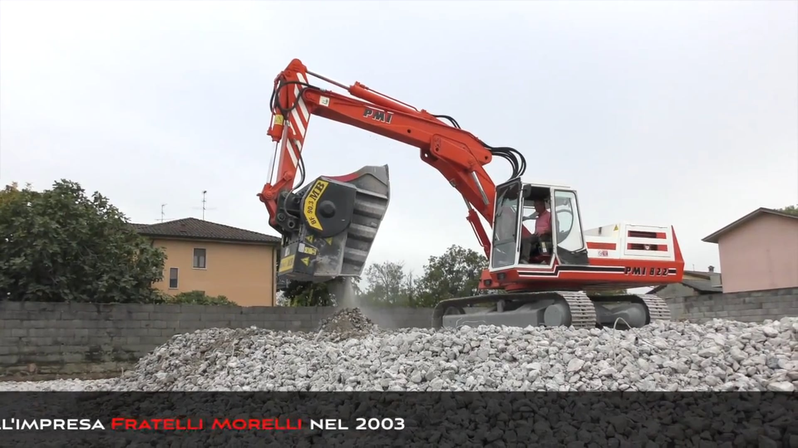

# MBアタッチメントを使って資材を再資源化する５つのスタイル

資材リサイクルへの取り組みが活性化しています。目指す方向は皆ほぼ同じ：廃棄物処理のための解決策を見出すこと。

建設副産物をどのように処理するか。これは、オペレータにとっても工事現場においても、また行政にとっても極めて重要な課題です。処理時には騒音や粉じんが発生するため、周辺環境に与える影響に配慮が必要となり、現状課題クリアには多くの困難が伴います。使用できる建機や車両に制約があったり、それら工事車両のメンテナンスにかかるコストがかさんだりすることや運搬に関わる問題点も現場の頭を悩ませる要因です。

そこで、最もシンプルな打開策をMBクラッシャーがご提案します。

MBアタッチメントを使えば、資材の再資源化に関わる一連の処理を現場にいながら行うことが可能です。効果は一目瞭然。運搬等のコストを大幅に削減し、ダンプ等の車両を必要としないため環境保全にも貢献するだけでなく、現場の収益性も向上します。

MBアタッチメントを取り付けるだけで、あらゆる建設機械が高効率で無敵のツールに早変わり。現場内で工事発生材を処理し、再利用可能な資材を生産します。このようにして生産されたリサイクル材は現場内で再利用したり、別の用途のために第三者に売却したりすることもできます。

このように、MBアタッチメントを使うことにより、廃棄物のリサイクルが利益に変わります。しかし、それだけではありません。もう少し詳しく見ていきましょう。

- コスト削減

現場内で破砕や分別処理を行えるため、他の人や機械に頼ることなく廃棄処理と運搬にかかるコストをカットできます。

大規模な採石場についても同じことが言えます。例えば、サウジアラビアの採石場。こちらではバケットクラッシャーBF135.8（43トン以上の油圧ショベルに対応）とスクリーンバケットMB-S18（20〜35トンの油圧ショベルに対応）が連携プレーで発生土を処理。MBアタッチメントによって得られた再生材は首都リヤドの地下鉄建設工事現場で再利用されました。つまり、掘削を行った会社が、掘削土の分別・破砕、そして、処理済材の再利用、と全ての作業をたった１社でこなしたのです。これら全工程において他の補助を必要としなかったため、大幅なコスト削減に成功しました。

- 廃材から利益を生み出す

廃材もMBクラッシャーの手にかかれば質の高い資材に生まれ変わります。そして、それは利益となり戻ってきます。ここでは、北イタリアのある現場で伺った貴重な声をご紹介します。「がれき処理にMBのバケットクラッシャーを使うことで、廃棄処分される運命だった『廃材』がCEマークの付いた『資材』に変換できるんです。今回私たちは鉄筋コンクリート造の養豚施設を解体し、格子状ブロックが敷き詰められた床も取り壊して、施設を建て直しました。コンガラには鉄筋が混じっていましたが、MBバケットクラッシャーには除鉄用のマグネットを付けていたので問題は全くなかったです。破砕して得られた資材は現場内でそのまま再利用するには申し分のないクオリティでした。」

- 使用燃料費の削減

MBアタッチメントによって「生まれ変わった」資材は、現場内で埋戻し材として再利用されるほか、新たな建設工事やその他様々な用途に有効利用できます。また、他者に売却することも可能です。どちらにしても、現場にとっては確実にかつ計画的に収益を上げることを意味します。

バケットクラッシャーとスクリーンバケット。この２つのMBアタッチメントを合わせて使用することで、資材のサイズダウン、洗浄、再利用の全ての作業が現場内で行える資源循環システムを作り上げたスイスのお客様の声をご紹介します。「競争力のある価格でお客様にサービスを提供できるよう、工事で発生する資材をリサイクルして、コストを削減する方法を探していた時に出会ったのがMBです。メリットは資源のリサイクルだけではありません。MBアタッチメントを使用することにより、燃料費、人件費、消耗部品コストも削減できました。無駄のない再資源化に成功すると同時に、マシンを停止させずに連続稼働できるので競争力の強化も実現することができました。MBを選んでいなかったら、こんな理想的な状況は作り出せなかったでしょう。」

- 長寿命製品に投資

「年の割に元気」。人に向かって言ったら失礼なフレーズですが、MBアタッチメントにならぴったりの言い回しです。短期間で回収できる設備投資というだけではありません。製品寿命がごく長いのもMBアタッチメントの強みです。スロベニアの首都リュブリャナから約30キロ離れた採石場では、バケットクラッシャーBF120.4が10年を超えて今もなお、苦灰岩を破砕し続けています。スロベニアのお客様にお話を伺うと、今までで唯一メンテナンスコストらしいコストと言えるのはトランスミッションベルトの交換ぐらいです、とご満足いただいている様子。その交換作業も、技術者を呼んだり整備工場へアタッチメントを持ち込んだりする必要もなく、オペレータ1人で簡単に現場内で行えます。

- 安全で快適な作業環境

MBアタッチメントで資材を処理するのは比較的楽な仕事です。なぜなら建機の運転席に座ってアタッチメントを操作し、作業を進められるからです。資材をすくい取って破砕する、あるいは、ふるい分ける。破砕材やふるい分けた資材を直接ダンプに載せたり溝に入れたりする操作も座ったままでOK。鉄筋などが混ざっていたら？MBなら大丈夫です。MBバケットクラッシャーやMBスクリーンバケットに取り付けた専用マグネットが破砕・選別処理後にきちんと回収してくれます。オペレータが運転席を離れる必要もありません。

メンテナンスもごく簡単、かつスピーディーに行えます。ドライバー1本あれば十分です。専門技術者のサポートも不要、マシンを停止させないので非稼動ロスも回避できます。

最後に北欧のお客様の声をご紹介します。「MBバケットクラッシャーを導入したのは数年前。区画整理に伴う工事現場内で関連作業を行うために使用しました。そして、現在同バケットクラッシャーBF90.3を使って多様な作業を行っています。この現場では解体材を破砕していますが、とにかく使い勝手がいいところが気に入っています。油圧ショベル輸送用トラックにアタッチメントも積み込むだけでいいのですから、特殊な運搬車両も必要ありません。現場に到着してから油圧ショベルに取り付けますが、簡単で時間もかからないため、到着後たった数分で本作業に取りかかれます。」

