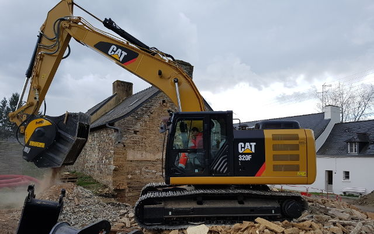
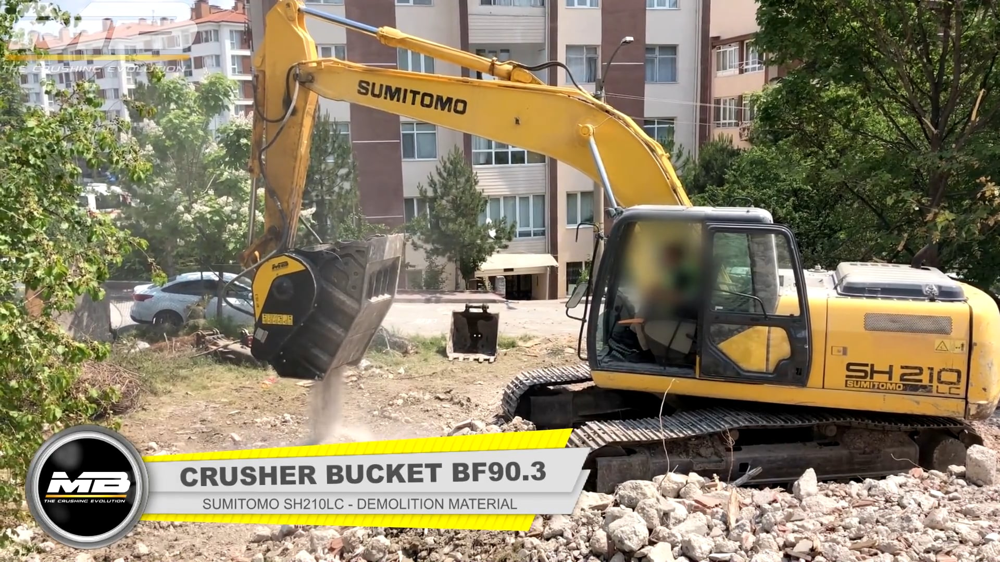
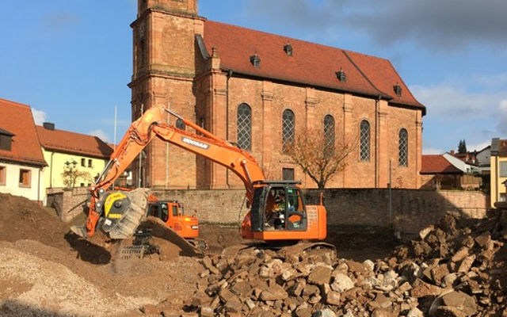
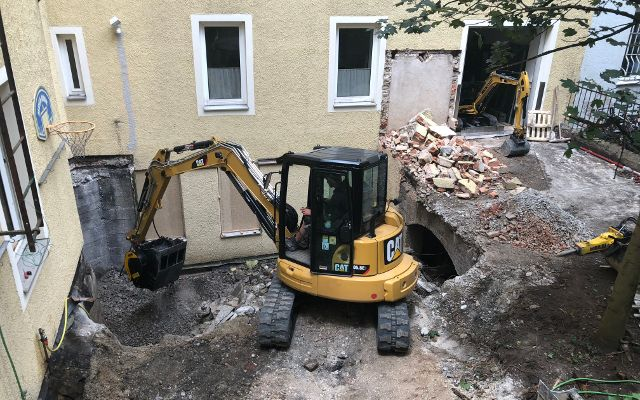
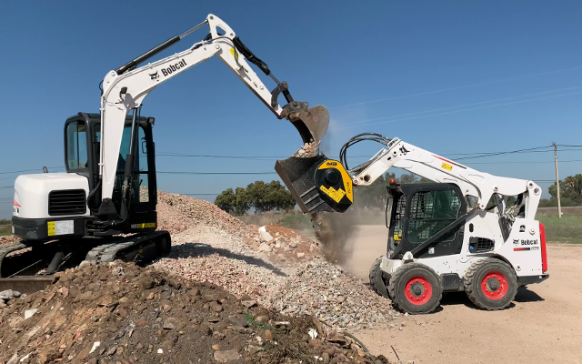
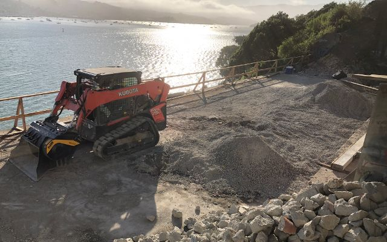
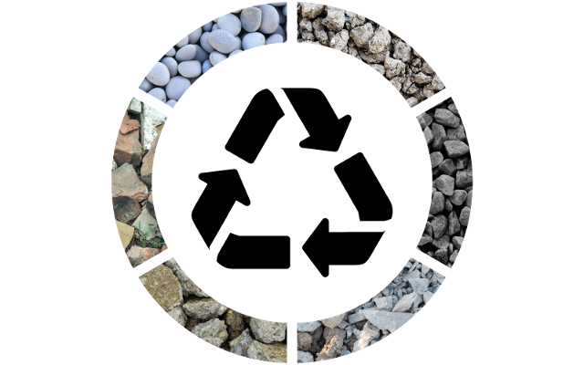

# MBクラッシャーのアタッチメントが「地球に優しい」解体現場を作り出す

無駄な廃棄はできる限り回避。
資材を選別し、必要に応じて現場内外で処理して再利用。

全て

- 建機一台で
- オペレーター１人で
- 現場内で
- 短期間に
- 設備投資およびコストは最小限に抑えて

MBクラッシャーの各種アタッチメントは、このように多様な現場のニーズに対応するために考案され、設計されています。

古い倉庫を取り壊し、その場に新しい倉庫を建設したスペインのお客様をご紹介。 取り壊したものは新たな建設のために再利用。

フランスでは、古い家屋の解体工事で発生した廃材をほぼ全てリサイクルすることに成功。解体発生材はその場の新建築の基礎工事で再利用されたため、廃材の一時保管場所や処理に関わる問題に頭を悩ませる必要もなかったそうです。

幹線道路の整備工事で発生した玄武岩とアスファルトの混合物を回収し、その場で再利用したトルコの現場。建機を運転するオペレーター１人の働きにより最小コストで作業を終了。

## 大量に発生する解体副産物。しかし、それは全て廃棄物でしょうか。いいえ、違います。

解体工事にはいくつかの工程があり、時間とコストがかかります。だからこそ、作業を効率化できる可能性も秘めています。適正な基準に従い、適切な手段を用いれば、工事を担う企業にとってデメリットがメリットになる可能性も大です。「地球に優しい」解体現場では、通常なら処理場行きになっていた解体発生材の約80％を回収できます。 「地球に優しい」解体工事や再建設工事はコストが高くなるように見えます。

しかし、実際には
- コスト削減
- 廃棄物運搬費・処分費用の削減
- 作業時間の短縮
- 交付金などの支援

「地球に優しい」解体工事は、発生材を有効利用できるため、建設分野における循環型社会形成の第一歩となります。また、工事のクオリティは、工事発生材がどのような工程で、どのような機械によって選別・破砕処理されるかに大きく左右されます。

MBアタッチメントを使用することで、現場で発生する廃材が価値のある資材に生まれ変わります。発生材の有効利用は環境に優しく、会社には利益をもたらします。

持続可能な「地球に優しい」解体プロジェクトは、適正に行うことにより、現在利用されていない土地に価値を付加します。空き家や閉鎖された工場などを解体し、建て直したりして有効活用できれば、防災、衛生、景観の面において周辺の地域にとってもプラスになります。

MBバケットクラッシャーなら多種多様な素材が破砕でき、破砕材はその場で直接再利用可能です。

MBクラッシャーのアタッチメントなら、再利用可能なものを最大限回収し、質の高い再生材を製造することができます。MBアタッチメントの活用により生まれるメリットは多くあります。

- 発生材の運搬コストの削減
- 中間処理工場等の処理にかかる費用の削減
- 新資材の購入費用のカット
- 製造した再生材の再利用・売却による収益の見込み

EUでは、建設・解体廃棄物の重量ベースのリサイクル率70％を2020年までに達成するという目標が設定されています。
この目標は、適切な手段を用いれば達成可能です。