# 現場の「ちびっ子」を主役に変身させるMBクラッシャーのアタッチメント

スキッドステアローダ、ホイールローダ、バックホーローダといった小型建機をパワーアップさせ、大規模な作業もおこなえるようにする方法をMBクラッシャーが公開します。コストと作業時間の削減も同時に実現。環境保全にも貢献します。

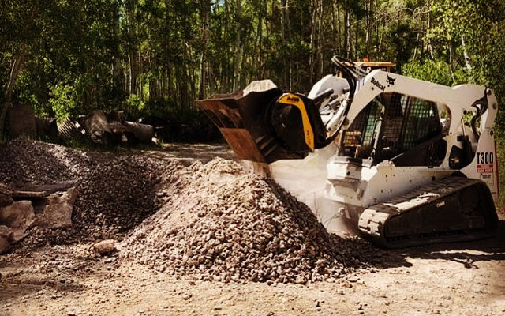

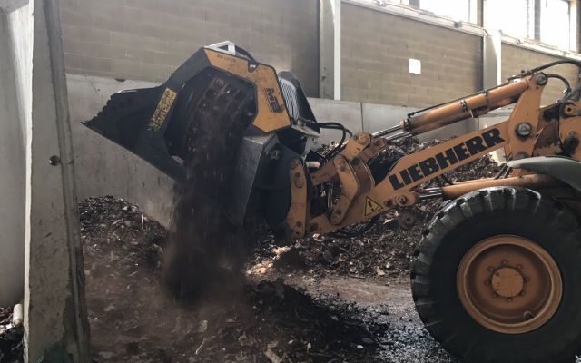
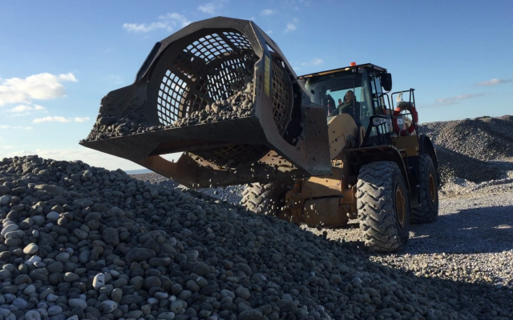

## スキッドステアローダ、ホイールローダ、バックホーローダで他に何ができる？

- 解体材や掘削材のサイズダウンやふるい分け​;
- 鋳物工場での鉄片の分別;
- 配管埋設工事で発生する掘削材を処理して再利用;
- 農地での除礫や土壌改良のための選別作業.

これら全ての作業を現場内で直接おこなえます。作業車両の出入りが困難な現場でも、市街地でも閉鎖された空間でも問題ありません。

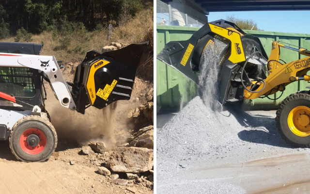

## 小型建機をパワーアップ・グレードアップさせる方法とは？

MBクラッシャーのアタッチメントは、様々なサイズの建機をパワフルな破砕機やふるい機に変身させます。

- 2,4トンから25トンのスキッドステアローダ、ホイールローダ、バックホーローダ各機種に取り付け可能;
- 多様な工事発生材を破砕、ふるい分けすることで、処理材の再利用や売却が可能.

## 主なメリットは？誰にとって得なの？
MBクラッシャーのアタッチメントは廃材を再資源化します。
つまり:

- 中間処理施設あるいは最終処分場への運搬コストの削減
- 新資材の調達費・人件費の削減、作業時間の短縮

自然環境および現場付近の住民や周囲環境にも配慮

- 粉塵発生および二酸化炭素排出の低減
- ダンプおよび公道使用の低減
- 騒音低減
- 作業の効率化による工期短縮

MBクラッシャーのアタッチメントは建機の油圧システムを利用して作動します。取り扱いもメンテナンスも簡単なので、専門作業員の力を借りなくてもオペレーター１人で現場内にておこなえます。

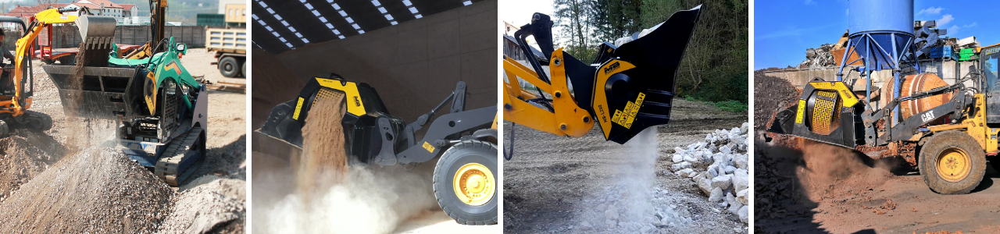

## コストと収益：どうしたら廃材から利益が生まれるか？​

MBクラッシャーのアタッチメントの使命は、まさに廃材を再利用可能な新資材に変換すること。

この活用法は多様な分野で応用できます。
MBクラッシャーのアタッチメントの中でも小型タイプは、多くの鋳物工場で砂型の破砕処理や鉄片の分別処理に活用されています。コストと時間の大幅な削減は実証済みです。

ボリビアでは、バケットクラッシャーをスキッドステアローダに取り付け、現場に放置されていた花崗岩を破砕処理して再資源化しました。追加コストはゼロ。鉄筋コンクリート製造用骨材を作り出すことで収益源の獲得に成功。

スペインの会社は、配管埋設工事で発生した掘削材をその場で処理し再利用することで、運搬費と新資材調達費の完全カットを実現。
どうやったのかって？バケットクラッシャーMB-L160をボブキャットのスキッドステアローダに取り付けて作業しただけです。

<a href="https://vimeo.com/362735760" target="_blank">
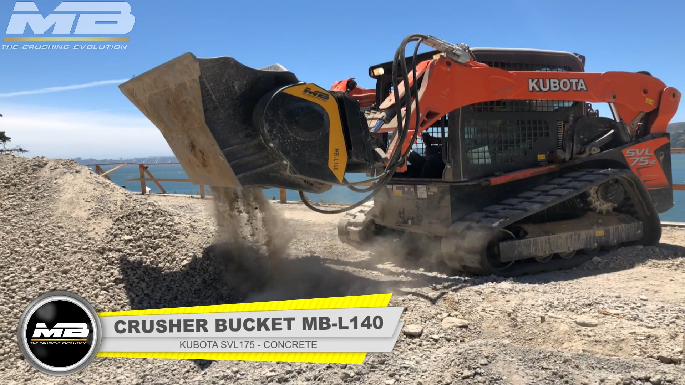
</a>

## 作業しにくい現場や作業車両が出入りしにくい場所ではどうする？​

アメリカ合衆国、火山性丘陵に建つ建築物の解体現場。コンクリート製の支柱、床、壁を取り壊す必要がありました。制約のある車両出入りに、限られた作業スペース、と困難の伴う現場です。そこで、バケットクラッシャーMB-L140をクボタのスキッドステアローダに取り付け、山積みのコンクリート塊を破砕していったのです。細かく破砕されたコンガラは再生砕石としてよみがえり、現場の工事用道路の造成に再利用されました。

コストへの影響？新資材調達費用を50％削減。

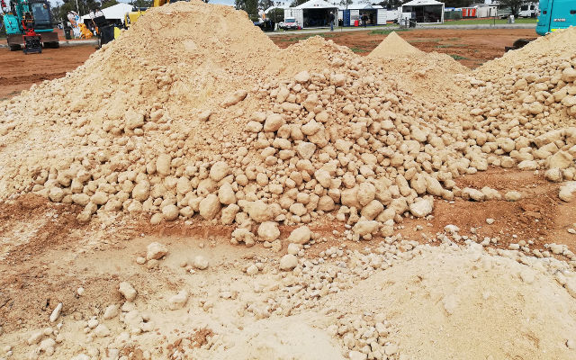
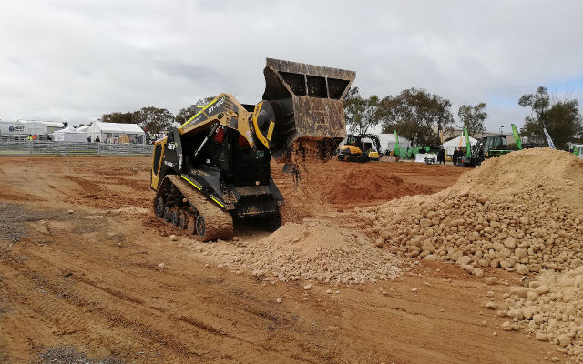

## 工事現場だけでなく、農業分野でも応用できる画期的な使い方はあるのか？

塩害により荒廃した広大な土地を抱えるオーストラリアの事例が象徴的です。この国では3200万ヘクタールにわたって広がる土地の劣化により、年間およそ35億USドルの経済損失を引き起こしていると推定されています。農地の塩害対策（除塩）の一つに石膏の投入があります。土壌に石膏を混ぜることで粘土質の土壌が改善され、水はけが良くなるのです。

ここでは、バケットクラッシャーMB-L140をスキッドステアローダASV RTに取り付け、大量の石膏の塊を粉砕。細かくした石膏を土壌に混ぜ込み、耕作可能な土壌にすることで危機を乗り越えました。

## なぜMBクラッシャーのアタッチメントは地球に優しいの？​

廃材の再資源化と能率的かつ経済的な処理方法が保証されているからです。コンガラ、鉄片、石や土の混合物、有機物、廃棄物など多様な工事発生材を処理施設に運ぶことなく、現場内で破砕、選別できるのです。一般廃棄物の処理を管理する自治体での活用にも大きなメリットがあります。

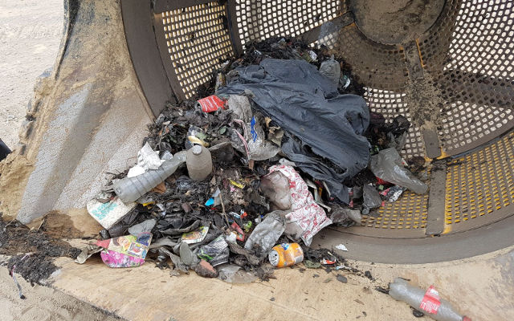
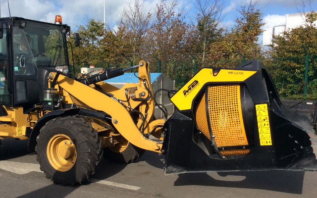
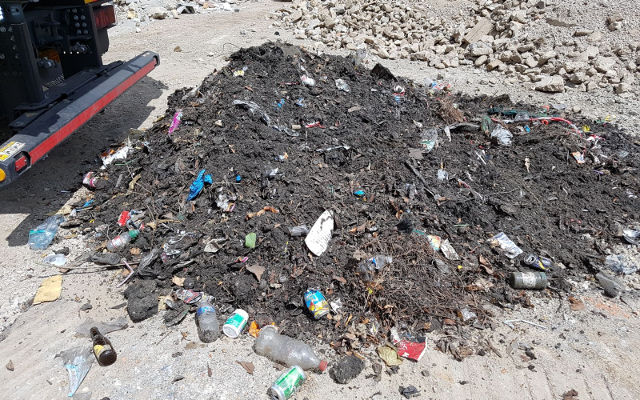
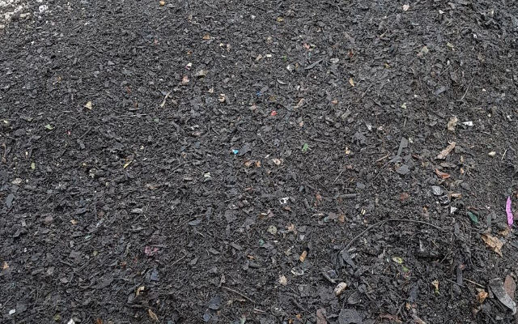

フランス北西部ノルマンディー地方のある市では、スクリーンバケットMB-LS170をバックホーローダに取り付けて使用。木片やプラスチック、空き缶など、清掃活動により収集されたゴミを分別しました。

つまり

- 追加コストゼロ
- 廃棄物処理の効率化
- 地球に優しい
MBクラッシャーなら、あなたの現場にぴったりのソリューションがきっと見つかります。

さて、あなたならどうしますか。
ご使用の建機と現場に最適なアタッチメントをご覧になりませんか。