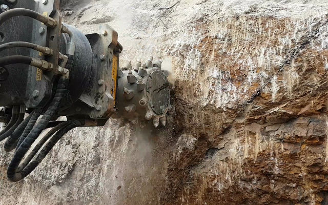

橋、トンネル、遊歩道等に関わる工事では、しばしば事業者に数々の課題への対応が求められます。市街地での工事や交通量の多い道路での工事ともなればなおさらです。
そんな時解決策となるのがMBクラッシャーのツインヘッダーです。正確な切削とコンパクトなボディーにより、複雑な作業環境でも柔軟に対応し、優れたパフォーマンスを発揮します。

## 世界に散点する特殊な現場でMBクラッシャーがソリューションとなるわけ。

多種多様な用途に活用できるアタッチメントだから。
活用例：

- 川底を掘り下げたり川幅を広げたりする治水工事や道路・橋の路面切削工事のように、時に必要となる水中での作業
- 市街地の埋設工事による狭い場所での路面の削ぎ取り
- 採石場や採掘場での岩壁の切削
- 住宅密集地にて土台や基礎などの礎石の切削が行われる解体工事
- 除礫や混層耕による土壌改良

## ツインヘッダーを実際に活用されたお客様の事例をご紹介します。

ドイツのドレスデン、エルベ川に架かる歴史あるアウグスト橋の修復工事。橋げたに使用されているコンクリートが橋の構造に支障をきたしているということで削り取ることに。現場にあるリープヘル918に対応するアタッチメントを見つけ出す必要がありました。
お客様がチョイスされたのは、ツインヘッダーMB-R800。切削作業は２段階に分けて行われました。

- ジョイントを撤去するための床版切削。振動の発生を最小に抑え、橋の構造そのものにもダメージを与えないよう慎重を要する作業でしたが、MBクラッシャーのツインヘッダーを使用して無事完了しました。
- コンクリート橋桁を削り取っていき、深さ３メートルまで切削する箇所もありました。

一方、ベルリンでは、交通量の多い高速道路アヴス（AVUS）の上に架かる古い橋の撤去工事が行われました。橋の下を走る道路の交通規制の回避は必須でした。

大型切削機による一次処理が行われたのちに用いられたのは、MBクラッシャーのツインヘッダー2機種、MB-R800とMB-R900。 MB-R800は10トン〜22トンの油圧ショベルに、MB-R900は19トン〜35トンの油圧ショベルに対応。このツインヘッダー2台でコンクリートとタールの多層構造部分を削り取り、切削処理を終了しました。

コルシカ島、海上５メートルの高さでの作業では、シリーズの中で最小のドラムカッターMB-R500が活躍。

問題となったのは現場そのもの。
- 狭い
- 作業するスペースが限られている
- 島の岬の断崖という過酷な現場条件
- 小型建機が１台やっと入るような現場

解決策？
ボブキャットのミニショベルE85に取り付けたドラムカッターMB-R500。

小型で小回りがきく、切削ドラムが1つのコンパクトタイプ。とても使い勝手の良いMBドラムカッターです。 ニーズに応じて各種カスタマイズが可能です。

- 回転ヘッドを取り付ければ、作業を中断することなく、オペレーターが運転席から自由自在にカッターの向きを変えられます。
- 切削深さ調節ガイド
- 散水装置
- 粉塵の飛散を抑えるドラムカバー

治水工事が行われたドイツのヴィッツェーツェ。川幅を広げるためにコンクリート製の橋台を一部削り、岩質の川底を掘り下げて、川の断面積を広げました。水面下1.5mの水中での作業。治水工事には導入設備を慎重に選ぶ必要がありますが、ここで選ばれたのはツインヘッダーMB-R700。MBツインヘッダーは全機種とも水中の作業に対応、油圧装置や機械部のトラブルとは無縁です。