# ロータリースクリーニングバケット MB-HDS で何が処理できる？
必要なのは建機１台とオペレーター 1 人。たった１台のアタッチメントで現場内の様々なものを処理。さらに時間とコストが削減できるとしたら？
作業が楽になり、コスト面でもメリットが大きいですよね。

なんと、そのソリューション、すでにあるんです。その名もロータリースクリーニングバケット MB-HDS。MB クラッシャーが展開する新シリーズです。

## 特徴は？
- ロータリーシャフトの交換が現場内で素早くおこなえる
- 多様な用途に柔軟に対応
- メンテナンスはその場でできて、しかも楽
- シャフト回転切り替え時のショックを緩和するショックレス油圧自動システム搭載
- 
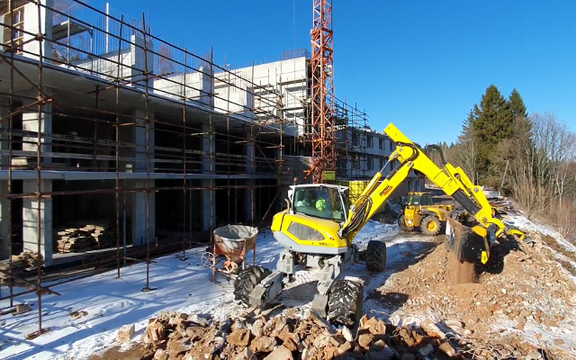
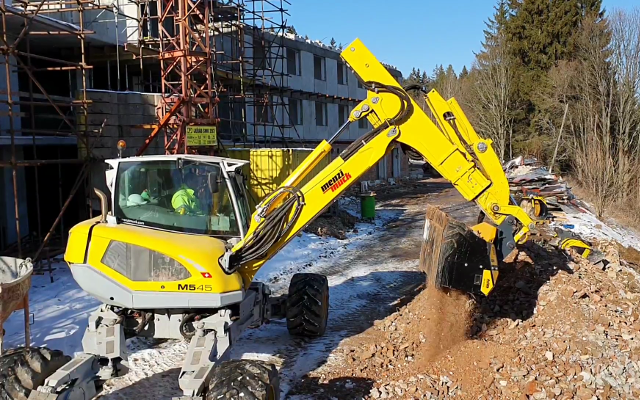

# 新ロータリースクリーニングバケット MB-HDS に出会う旅、世界の現場巡りの始まりです！
## 解体廃材
こちらはチェコ、古い宿泊施設の大規模な修繕工事現場です。処理・運搬コスト削減のため、現場で発生した解体材をその場で直接処理し、リサイクルする必要がありました。そこで選ばれたのが、新シャフトスクリーン MB-HDS214。ふるい用ロータリー RQ20 を装着し、メンツィムックの小型油圧ショベル M545 に取り付けて活用。

活用のダブルメリット

- 現場内で選別処理した発生材は質の高い基礎材として再利用
- 現場で使用する新資材の調達費を節約

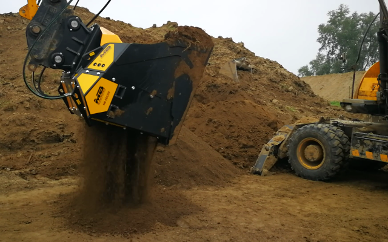

## 湿った土
こちらポーランドでは、JCB の油圧ショベル JS175 に取り付けたロータリースクリーニングバケット MB-HDS320 が大活躍。川の堤防強化工事に利用するために湿った土を攪拌しています。べたついたり固まったりしやすい湿った土でも、ふるい用ロータリー RQ50 を装着した MB シャフトスクリーンは高い処理能力を発揮。
ふるい用ロータリー RQ50 の活用は多岐に渡りますが、次の用途にも適しています。

- 土や湿った材料のふるい分け
- 肥料の切り返し
- 土壌の攪拌による空気供給

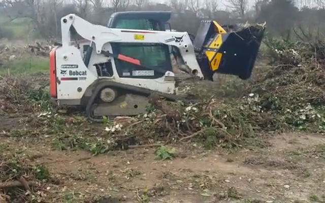
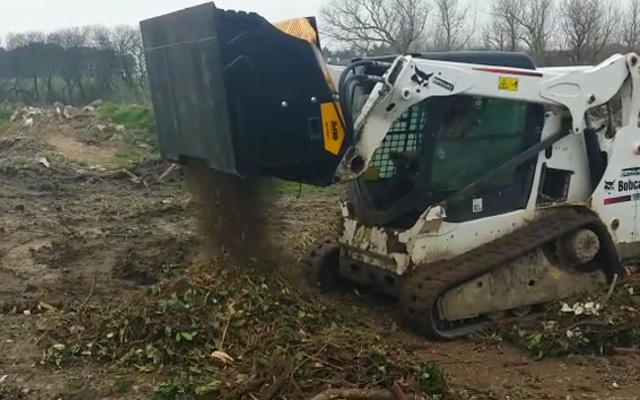

## 木の枝
次の目的地はフランス。こちらではボブキャットに取り付けられたロータリースクリーニングバケット MB-HDS214 が木の枝を細かく破砕して、緑地整備をおこなっています。新シャフトスクリーン MB-HDS には堆肥用ロータリー RC を装備することで、木の枝でも楽々処理。整備工事内の整理・除去作業や廃棄物処分作業を簡素化する有能アタッチメントです。

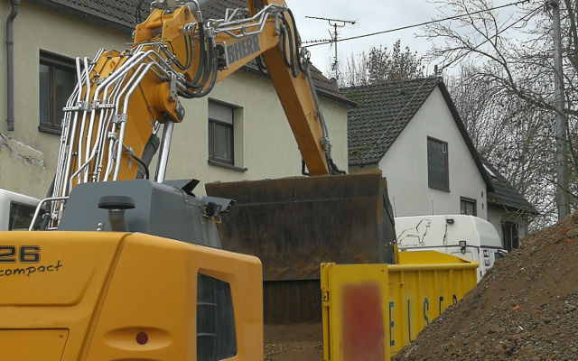
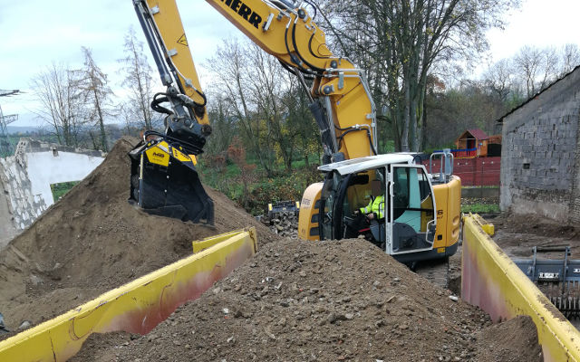

## 石の混ざった土
こちらドイツでは、リープヘルの油圧ショベル 926 に取り付けられた新シャフトスクリーン MB-HDS323 に会えました。複数の解体現場を同時に管理されているお客様の事例です。各現場で発生する廃土・廃材が山積みになり放置されていました。そこで、新シャフトスクリーンを導入し、小石と土を分別するのに最適なふるい用ロータリー RQ20 を装着して使用。さらに、現場内でロータリー RQ20 を細分用ロータリー RE8 に付け替えて、土を選別しました。選別されて均質となった土は販売する場合にも有利です。

現場に積み上げられたまま活用されず「不要・邪魔なもの」でしかなかったものが、質の高い再生資源として生まれ変わり、再利用や販売も可能になります。

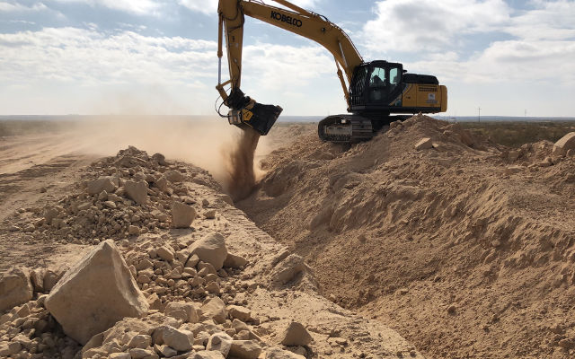
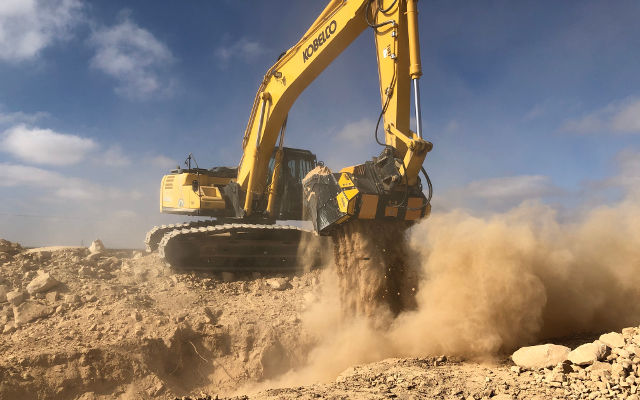

## 砂や岩
さて、アメリカに到着。こちらでは大規模なパイプ埋設工事でパイプの敷設床を形成する場面に新シャフトスクリーン MB-HDS320 を導入。コベルコ SK300LC に取り付け、岩が混ざった砂を選り分け、極めて効率的に作業をおこないました。
高い処理能力、作業の速さ、シンプルな使い方。MB アタッチメントの魅力はここでもキラリと輝きます。

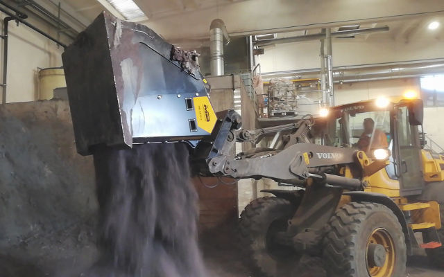
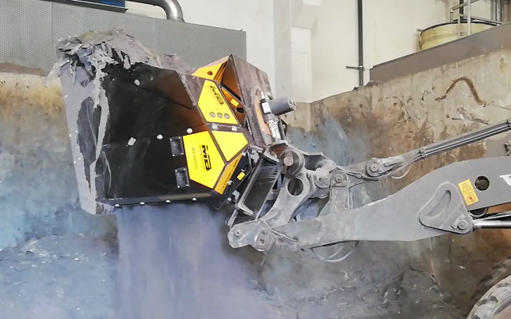
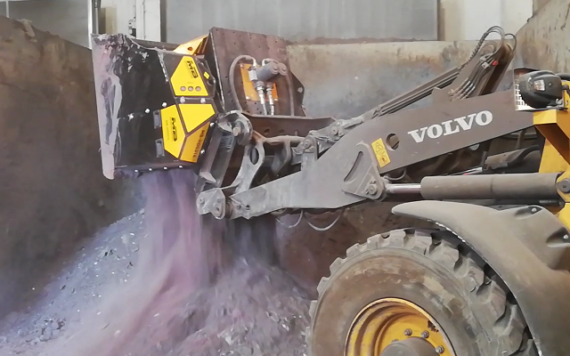

## 塵や灰
こちらはイタリア。フレコンバッグに詰められた粉末状の廃棄物を混合・攪拌している現場です。フレコンはトンバッグとも呼ばれ、廃棄物の運搬にも用いられます。

今回は、車の板金塗装専門工場を主とした塗装設備で発生した粉末廃棄物がフレコンバッグに詰められていました。攪拌用ロータリー RM を装着した新シャフトスクリーン MB-HDS314 をボルボのホイールローダ L50 に取り付けて、湿気で固まっていた粉末廃棄物を攪拌し等質にしました。

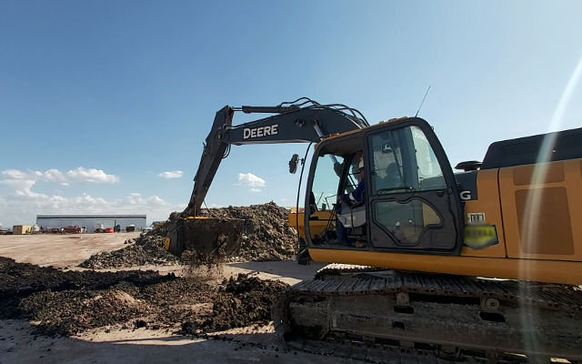

## 炭化水素によって汚染された土壌
アルゼンチンに降り立つと、そこはパタゴニア、油田地帯。ここには石油採取から物流、土地改良など各業界の企業がひしめき、それぞれの企業が汚染土壌回復と環境保全のための解決策を探し求めています。その中で MB アタッチメントをソリューションとして導入されたお客様の事例です。攪拌用ロータリー RM を装着したロータリースクリーニングバケット MB-HDS320 を John Deere の 20 トン油圧ショベルに取り付け、炭化水素による汚染土壌を分別し、土壌回復作業の簡素化を実現しました。

現場で働く人々の声に耳を傾け、個々のニーズに応えて生み出した新アタッチメント。
世界各地の現場が生産性・効率性の改善の宝庫となるよう、MB クラッシャーは常に新しいソリューションを提供します。

資材の運搬および工事車両の使用を最小限に抑え、その場にあるものを活用することで、

- 廃材のリサイクル
- 二酸化炭素排出量の低減

を推進し、地球に優しいソリューションを現場にお届けします。
