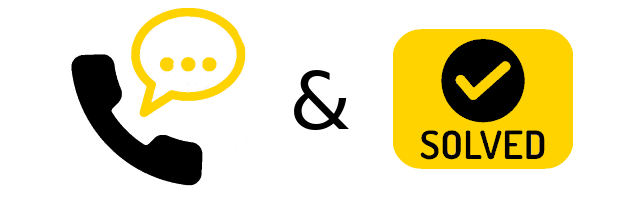
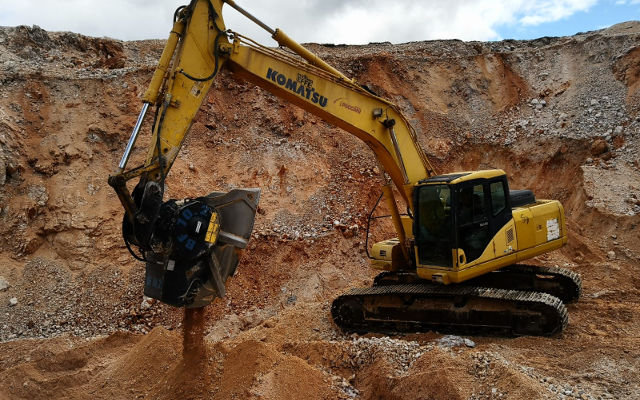

# 廃棄処理コストをチャンスに変える

解体工事等の現場で発生する多様な廃材。それに伴う廃棄物処理のコスト削減は現場の課題となっています。MBクラッシャーは、解決策として廃材のリサイクルに特化した建機アタッチメントを展開しています。

廃材を効率的に処理するメリット。

- 工事コストの削減、収益源の確保
- 外部に頼らず、企業を成長させることができる
- 処理場への運搬費と処理費の節約
- ビジネスの幅を広げられる

MBクラッシャーは、「ご相談&解決！」無料サービスを通じ、世界各地の現場の声に耳を傾け、各企業様のビジネスチャンス開拓のお手伝いをしています。

どんな方法で？

お客様が現場で実際に直面されている課題を一つひとつお聞かせいただいた上で、新たな収益源となりうるビジネス分野を見極めて解決策をご提案いたします。

特許を取得したバケットクラッシャー第１号を現場に送り込んだ時から、MBクラッシャーは廃材の運搬・処理費カットを可能にする、完全な現場内リサイクルシステムを展開しています。

「ご相談&解決！」を通じてお客様から伺ったお悩みとそれに対する解決策を少しだけご紹介します。ここでの主役は14トンからの油圧ショベルに対応するバケットクラッシャーBF70.2。比較的小型の建機に取り付けても期待を裏切らないパフォーマンスを発揮するので、MBクラッシャーを信頼し任せてくださったお客様には導入の成果についてご満足いただいています。

## PB-1
「解体業をやっていて、解体発生材を処理場に持っていくことや処理にかかる費用がかなり負担になっています。コストを削減する方法ってあるんですか。」

建機１台あれば、MBバケットクラッシャーBF70.2を使って現場発生材をその場で破砕処理できます。固定式破砕機等を使用するために場外に運び出す手間もコストも省け、現場内での廃材の再資源化を可能にします。

お客様の現場では今、

- 解体発生材を全て現場内で処理、
- 廃材をダンプに積んで処理場に運ぶ手間とコストをカット、
- 作業時間とコストを大幅に削減、
- 路盤材や埋戻し材として活用できる再生砕石を現場で生産、販売することでビジネスの幅を広め、
- 工程も廃材・資材管理も簡略化されたため、工事が効率的に進んでいます。

## PB-2
「現場がちょっと不便な場所です。現場内で破砕したいのですが、どうしたらいいですか」

MBバケットクラッシャーBF70.2は各種建機に対応しています。取り付けるだけで、現場で使用中の建機が採石場のどこへでも移動できるパワフルな破砕機（ジョークラッシャー）に変身します。 起伏の多い土地や、固定破砕機等などの設置には向いていない場所でも、建機が入って行けるところならどこでも最大限の性能を発揮し、使いやすさもそのままです。

ドロミテの採石場で、2005年から休むことなく破砕作業を続けられているお客様。大量に採取される岩石を骨材に着々と変換していきます。頑丈で安心の設計ボディーのため、メンテナンスも楽なので、整備工場へ持ち込む必要もなく、稼働ロスもありません。

簡単に生産できるものの一例。

- 建設資材用の砕石
- コンクリート用の骨材
- 埋戻し材としての砕石
- バラスト軌道用の砕石や砂利
- アスファルト用の骨材
- 防水性を高める路盤用の骨材

## PB-3

河川の砂利を採取しています。これで利益を得ることできる？」​

もちろんです。MBクラッシャーのアタッチメントなら硬い対象物でも処理できるため、収益源の確保と現場の競争力の向上が可能です。

お客様の現場では今、

- バケットクラッシャーBF70.2を使って、河原で直接破砕処理、
- 採取したその場で作業し、
- 破砕処理して得られた再生材は道路工事用の骨材として活用されるため収益源となり、ビジネスの幅が広がりました。

## PB-4

「解体業をやっています。市街地での取り壊し工事が中心です。廃材の処理費が結構高いのですが、減らす方法ってありますか。」​

ここでのソリューションはMBバケットクラッシャーの導入。コンパクトで操作も簡単なので、使い勝手は抜群です。建機に取り付けたまま現場に入れるため、余計なコストもかかりません。

お客様の現場では今、

- アタッチメントを付けた建機で移動できるため、市街地と郊外の行き来が楽になり、
- 発生材をその場で処理できるので、公道使用による砂埃の発生と二酸化炭素排出を低減、
- 破砕処理した廃材を埋戻し材としてその場ですぐ再利用することで
- 作業時間の大幅な短縮とコスト削減を実現。

## PB-5

「個人でリサイクル事業を経営しています。小規模な現場向けの活用方法はありますか。」​

MBアタッチメントは企業の規模に関わらず、どのような現場にも対応しています。企業様や個人の事業主様、それぞれのお客様の潜在力を最大限に活かせるようお手伝いをするのがMBクラッシャーのミッションです。

お客様の現場では今、

- 解体廃材をエンドユーザーから回収して自社のバンで運び出し、
- 置き場で破砕、
- 再生材は路盤材や埋戻し材として販売することで
- 活動の幅が広がり、収益率も向上しました。

## PB-6

「再開発事業に携わっています。鉄筋コンクリートなど大量に発生する現場発生材をなんとかしたいです。廃材を利益に変える方法ってありますか。」​

MBバケットクラッシャーは建機に取り付けて使用します。取り付けは簡単かつスピーディー。鉄筋コンクリートも簡単に破砕できます。鉄筋は破砕されたコンクリートと共に下に落とされます。

お客様の現場では今、

- 鉄筋コンクリートを破砕してリサイクル、
- 鉄筋コンクリートの柱を破砕、
- 古いPCまくら木を破砕することで
- 再生材を製造し販売します。販売された再生材は、大規模な新設路線の建設工事で路盤材として使用されます。

